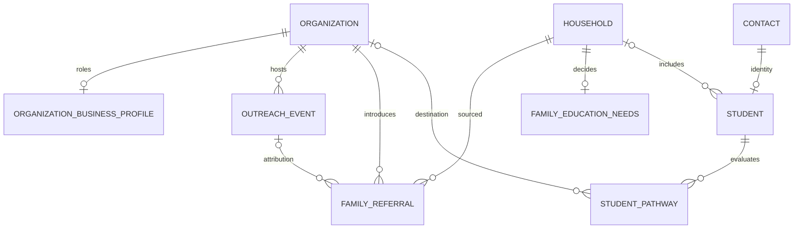

# 大学预科/桥梁业务：第一性原理审计

基线：v3.15.0 / ee84493；日期：2026-10-02。范围为业务架构、数据库结构、客户操作及相关 UI；不是生产环境安全认证。代码证据和推论分开陈述。实施记录见 [修改计划](FIRST_PRINCIPLES_PLAN_2026-10-02.md)。

## 业务不变量

公司的价值是帮助学生从当前教育阶段进入适合的大学路径。学校是获客入口；机构可以转介家庭、共同组织游学；家庭承担决策及预算；学生接受服务。一次宣讲或游学是获客/了解环境的活动，不等同于录取或收入。合作方、付款方、受益学生应分别记录。关系熟悉程度不能替代升学准备程度或真实转化。

实体原则：组织是法人/机构记录，联系人是自然人，家庭是决策群体，学生是联系人之上的教育档案。一个组织可承担多个业务角色；一个学生可以有多个升学方案。家庭预算不等于家庭收入；渠道归因不是自由文本；未知值不是零；不同币种不得相加。新流程引用已有实体，不复制身份、合同或支付台账。

## 发现与证据

|优先级|发现|证据|业务后果/修复|
|---|---|---|---|
|P0|组织分类存在却无法在客户编辑中维护，学校/机构/大学业务角色不明确|迁移005有 organization_type；crm-repository.ts、crm-record-editor.tsx未加载/编辑它|新增组织业务档案，维护既有分类及多角色；列表和名称显示学校与机构|
|P0|家庭需求没有可查询的预算、意向项目和计划时间|迁移075及 education API 以 expectations/background Markdown 为主，收入字段不是教育预算|新增家庭需求表，项目类型、预算区间/币种、意向地区、预计入学时间、决策阶段|
|P0|学生档案主要是校内学籍，不是大学预科服务路径|students/current_grade、academic_year、progression；admission_journeys只有概括阶段|新增多方案升学路径：学生、预科/桥梁类型、目标院校/专业、入学日期、申请期限、语言成绩、准备阶段、下一步；不替代已有学籍/申请审批|
|P1|宣讲与游学只能退化为活动笔记或通用 campaign|crm_activities 为通用活动；growth_campaigns/attribution没有结构化组织活动和家庭参与关系|新增学校宣讲/校园访问/游学活动，主办组织、时间/地点、状态、人数；转介可关联活动|
|P1|无法回答是哪所学校/哪个机构介绍了哪个家庭|contacts.acquisition_source 是文本；lead_attribution_touches只有 campaign/lead|新增组织→家庭转介，可关联活动、介绍联系人，记录日期/状态/下一步；不通过关系等级推定成交|
|P1|客户详情只显示少量通用字段，结构化信息缺少入口|customer-operations-view.ts 的 profileFields；CustomerOperationsPanel|新增业务工作台及客户详情上下文入口；组织/家庭/学生分别提供相关结构化内容|
|P1|学校创建表单收集的联系人文本没有建立或保存任何联系人关系；机构也被要求填写课程|ModulePage 的 contact 输入与 createCrmRecord 的组织写入字段不对应；CRM 创建/编辑 API 的 curriculum 最短长度为1|移除无效联系人输入并说明真实关联流程；创建时明确组织分类，课程允许待补充，避免机构伪造学校字段|
|P1|新增表若只使用UUID外键仍会允许跨工作区关联|现有表多处只有单列FK，新写入不能照抄|新表采用工作区复合FK、主体/关联记录访问检查、RLS、只读表授权及原子RPC；版本并发、幂等重试和审计|
|P2|完整度90为创建时常量，关系等级以吃饭/家庭聊天为依据|createCrmRecord/create_customer_contact；relationship_milestones|不将旧完整度和熟悉程度用于升学建议；新工作台只对真实缺失字段、过期截止日、未确认转介发出可解释提示|
|P2|大量历史版本组件/迁移文件使领域边界难辨识|v200/v220 repositories、多个迭代样式与大组件|新领域独立输入契约、仓储、UI；历史迁移不可重写；全库拆分需独立任务，避免本次同时改权限/财务|
|P1（未修复）|家庭不是直接签约主体，合同创建仍要求组织|contract-repository.ts/createContractDraft、contracts API及create_contract_draft；083仅增加customer_contract_links|家庭需求已独立建模，但合同/报价/续约/收入归集仍需一次配套迁移，当前保留现有家庭合同链接；不得将本次结果视为家庭财务闭环完成|

## 目标关系结构

## 新功能及边界

本次实现：组织多角色档案、家庭需求档案、学生多路径方案、学校宣讲/校园访问/游学管理、渠道转介登记、可解释业务提醒、分页工作台和上下文入口。

后续候选（不纳入本次执行计划）：项目批次/席位和录取条件目录、报名参与人及出行授权、正式大学申请清单与材料版本、转介佣金结算、带真实数据的渠道投入产出报表、家庭自助需求收集。它们分别需要实际产品规则、出行管理规则、申请材料清单、佣金协议及同意范围；本次不擅自设定这些制度，也不将游学意向当报名或转介状态当成交。

数据迁移采取扩展方式：保留所有旧字段和业务关系，不从 Markdown 自动猜测预算、成绩或来源。旧组织分类保留，不批量把学校改成机构；新字段为空时明确展示待补充。现有家庭类型组织需人工核实与 household 对应后再合并，禁止按名称自动合并。生产数据覆盖程度必须在迁移后由业务人员确认；本次本地验证不声称已修复线上数据。

## 实施后验证发现

真实浏览器操作发现目标地区允许未知，但控件错误标记必填；已修正。截图检查发现刷新按钮缺少翻译；已补齐两种语言并增加文案回归。新工作台的所有建议使用数据库会话中的工作区业务日期，而不是浏览器个人时区。组织业务档案分类与原 organizations.organization_type 同步；既有组织分类是权威值。

旧通用完整度百分比和关系熟悉度仍保留兼容，但新升学工作台不使用它们作为招生评分。历史组件全库拆分、真实数据补录及规则未定的新产品能力不是已完成事项，详见计划的上线与扩展边界。
