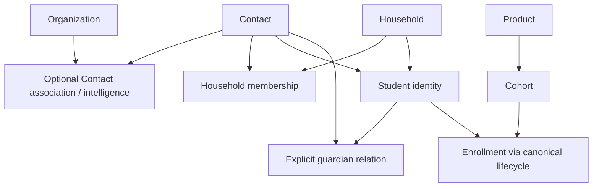

# v3.25 — Import Operations Architecture

## Released contract and historical inspection

The v3.25 contract is the activated Phase 2 and Phase 3 runtime below: typed fields, categorized
versioned templates, strict preflight, canonical mutations, authorized references, relationship
imports, bounded Import Sets, guarded retry/rollback and private subject-aware evidence retention.
It reuses the existing import engine. [Release notes](RELEASE_V3.25.0.md) and
[release verification](V325_RELEASE_CLOSURE.md) describe the final closure.

The following Phase 1 sections are historical inspection findings, not current availability or
unresolved activation status. The explicit Phase 2/3 sections define the activated behavior.

Phase 1: **Import Capability & Field Contract**. Baseline `main`,
`eee07f1866a314129f2ae1923ab45d87ac93ec6f`, version **3.24.1**.
The sections below through Field Coverage Matrix record the Phase 1 inspection baseline, including
its then-unimplemented activation gates. Phase 2 runtime decisions are recorded in
[Phase 2 Activated Runtime Contract](#phase-2-activated-runtime-contract) and supersede those historical
availability statements. The [typed registry](../lib/import-field-contract.ts) now supplies v2 templates
and normalization; legacy headers remain unchanged. See [Phase 2 verification](V325_PHASE2_VERIFICATION.md).
Phase 3 relationship/Set execution and new-v2 subject erasure supersede the historical deferred
statements below; see [Phase 3 runtime contract](#phase-3-relationship--batch-reliability)
and [Phase 3 verification](V325_PHASE3_VERIFICATION.md).

## Import Resource Contract

Reuse the existing imports workspace, batch/row tables, mapping profiles, parsing, repair and rollback.
Keep resources separate; never introduce a combined Organization/Household/Contact template.

| Resource | Current headers | Current template | Execution / operation support |
|---|---:|---|---|
| ORGANIZATIONS | 14 | Separate blank/example/guide CSV; LEGACY_UNVERSIONED | `process_import_batch_legacy`; independent SQL CREATE, duplicate UPDATE/MERGE, SKIP |
| HOUSEHOLDS | 11 | Same variants, own headers | Legacy SQL CREATE, duplicate UPDATE/MERGE, SKIP |
| CONTACTS | 5 | `nameZh,nameEn,email,phone,title` | Legacy SQL CREATE, duplicate UPDATE/MERGE, SKIP |
| STUDENTS | 15 | Own CSV; personId/householdId are UUID references | Legacy SQL; Contact supplies Student identity; UPDATE cannot change personId |
| COHORTS | 15 | Own CSV; productCode/cohortCode/ownerEmail | `resolve_education_import_row` + `save_product_cohort`; CREATE/SKIP only |
| ENROLLMENTS | 11 | Own CSV; studentNumber/cohortCode/ownerEmail | Same resolver + `save_student_enrollment`; CREATE/SKIP only; status history preserved |

Current [sheet parser](../lib/import-sheet.ts) accepts CSV/XLSX, validates header uniqueness and row
shape, trims cells and discards wholly empty rows. UI limits: 10 MiB, 10,000 rows. Server accepts up to
10,000 mapped rows; process chunks are at most 100. XLSX download templates are not implemented.
The browser posts normalized mapped rows, filename and client-computed hash, not original file bytes.
Do not describe the hash as a server-verified original-upload checksum.

Mapping profiles are per workspace/owner/resource/name. They currently have no template version or
optimistic revision. Current header matching removes separators/case and ignores unmapped columns;
the API accepts a union of six resource field sets rather than a strictly resource-specific row schema.
Both are version/parity gaps, not permission to silently discard future v2 columns.

Sources: [fields](../lib/import-fields.ts), [CSV template](../lib/import-template.ts),
[imports API](../app/api/imports/route.ts), [template API](../app/api/imports/template/route.ts),
[workspace](../components/imports-page.tsx), [repository](../lib/phase2-repository.ts),
[legacy profiles](../db/migrations/202608110075_structured_profiles_teams_and_terminal_approvals.sql),
[education import](../db/migrations/202610040094_operational_readiness.sql).

## Field Coverage Matrix

The machine registry records resource, business key, canonical table/column, mutation owner, type,
create/update allowance, create requirement/group, sensitivity, current header, validation and support.
Tables below are a projection of that registry. `C/U` is desired allowed operation, not legacy execution
coverage; `N/N` denotes derived/read-only/deferred fields. Optional fields must remain optional.

Mutation owners:

| Resource/scope | Formal owner | Concurrency / adapter requirements |
|---|---|---|
| Organization core | `createCrmRecord('schools')`; `updateCrmRecord` → `update_school_customer_profile` | `expectedUpdatedAt`; create currently uses repository table gateway/RLS; type is create-only in core API |
| Household core | `createHousehold`; `updateHousehold` → `update_household_profile` | `expectedUpdatedAt`; create uses repository table gateway/RLS |
| Contact core | `createCrmRecord('people')` → `create_customer_contact`; `updateCrmRecord` → `update_contact_profile` | `expectedUpdatedAt`; update defaults omitted profile values: load authorized current values before full-input mutation |
| Contact WeChat | `save_contact_communication` via communication route | Separate mutation; `expectedUpdatedAt`, education.manage; not a generic Contact patch field |
| Organization / family-needs profile | `saveEducationBusiness` → `save_education_business` | `expectedRevision`; canonical profile schemas and range checks; separate profile operation |
| Student core | `createStudent`; `updateStudent` → `update_student_profile` | `expectedUpdatedAt`; identity remains Contact, no import name rewrite |
| Cohort / Enrollment | `saveProductCohort` / `saveEnrollment` | Revision + request receipt; lifecycle validation; retain current CREATE/SKIP import compatibility |

Core Organization type and profile type have different accepted sets (profile also exposes FAMILY).
They synchronize through existing domain logic; never treat them as independent conflicting facts.
No core country/province/region, Organization phone/email/tags/classification, or universal team field
was found in these forms/mutations. Desired additions are `REQUIRES_DOMAIN_EXTENSION`, not new JSON
columns. Organization focus_regions is a business-profile interest list, not its address country.
Contact address/region and Household country similarly require separate domain work.

Household income is not family education budget: the latter is `family_education_needs`.
Current monetary form schemas use JavaScript Number; future import monetary input must stay decimal
text end-to-end, with a reviewed exact-decimal domain adapter before activation. No implicit FX.

## Reference / Relationship Contract

Users must not need database UUIDs, and names must never select a record automatically.
Use existing actor-visible selectors to produce opaque selected-reference tokens, plus proposed
import-set-local typed aliases (e.g. `@organization:school-1`). Tokens resolve server-side under current
authorization. Aliases resolve only after their earlier CREATE/selection succeeded; no permanent second
business ID is created. This protocol is specified here and implemented in Phase 2–3.

| Target | Primary reference | Secondary lookup | Missing / ambiguous / hidden behavior |
|---|---|---|---|
| Organization / Household / Contact | Authorized selected token; typed set-local alias for new rows | Search/email/phone produces review candidates only | Missing or inaccessible → same `INVALID_REFERENCE`; more than one visible candidate → `AMBIGUOUS_REFERENCE`; never first match |
| Product | Visible workspace-unique code; selected token/alias | Explicit selection | Same rules; code belongs to requested workspace |
| Cohort | Visible workspace-unique code | Explicit selection | Same rules, Product context/lifecycle checked |
| Student | Visible workspace-unique studentNumber when present; selected token/alias otherwise | Contact selection establishes identity | Never match Student name or transliteration |
| Staff Owner | Explicit visible staff selection; current ownerEmail lookup | Unique email within active workspace membership | Must be active, assignable, visible and in workspace; otherwise safe invalid reference |
| Opportunity | Authorized selected token/alias; legacy UUID compatible | Explicit selection | Never assume display text is a formal reference code |

Legacy UUID columns remain supported under the existing legacy resource selection. They are not the
future user-facing reference requirement. Contact email can be missing/shared/changed, and matching
phone formatting is not identity proof. No formal Organization/Household external business reference
was found in inspected canonical forms/storage. **No migration 111 is required for Phase 1**: selected
references and batch-local aliases suffice for the planned contract. If later a permanent external
reference proves necessary, require workspace-scoped non-null uniqueness, normalization, controlled
changes and audit; do not add unconstrained reference text.

| Relation | Canonical storage / attributes | Identity / cardinality | Owner / concurrency |
|---|---|---|---|
| Organization ↔ Contact association | `contacts.organization_id` | One optional Organization per Contact; Contact can be standalone | `create_customer_contact`; generic reassignment lacks a formal update input; defer update support |
| Organization primary contact | `organization_business_profiles.primary_contact_id` | Profile-selected visible Contact; not legal signatory | `save_education_business`, revision; context validation required |
| Household ↔ member | `household_members`: member_role PARENT/GUARDIAN/STUDENT/PAYER/OTHER, primary_contact | Unique household/contact pair, **role not part of identity**; Contact can be in multiple Households | `save_household_member`; selecting primary resets others; current upsert lacks optimistic revision / payload receipt |
| Student ↔ identity / Household | `students.person_id` / `household_id` | Unique workspace/person, optional Household; not membership or signing authority | Student create/update; person immutable on update |
| Student ↔ guardian | `student_guardian_relationships`: relationship, primary_guardian, emergency_contact, explicit legal_authority | Unique student/guardian-contact pair | `save_student_guardian`; no current optimistic revision/receipt; never infer legal authority or signatory from relationship label |
| Organization Contact intelligence | `organization_contact_intelligence`: key_contact_status, decision_power_score, contribution_score, working_style_markdown, cooperation_notes, potential_notes | Unique workspace/contact; composite FK requires Contact belongs to that Organization | `save_organization_contact_intelligence`; revision + request key; scores 10–100, narratives ≤10000 |
| Contact ↔ Contact in Organization | `organization_contact_relationships`: relationship_type, note ≤2000, status ACTIVE/INACTIVE | REPORTS_TO/INFLUENCES/ASSISTANT_TO directed; PEER/WORKS_WITH symmetric; OTHER; active identity includes role | `save_organization_contact_relationship`, revision + request key; both visible contacts must belong to same Organization; no self relation |

`organization_contact_relationships` is **not** an Organization–Contact membership table. All relation
operations authorize both parents, actor capability and workspace at execution; workspace-only legacy
checks are not sufficient proof of row visibility. Household and guardian relation concurrency/receipt
adapters are Phase 3 gates before batch execution. No relationship import is enabled in this phase.

This is a dependency graph, not a mandatory global file order. Independent Contacts/Households/
Organizations may be imported independently. Existing batch is one resource/file, not a multi-file set.
Phase 3 should add only bounded orchestration over existing batches; alias namespace is set/resource/
alias, immutable resolved identity, conflicting alias definitions rejected. Failed parents leave relations
pending/error; no name fallback, no child creation until reference resolution is valid.

## Create / Update Semantics

CREATE never overwrites a matching record. Potential duplicates require review. UPDATE requires a
resolved authorized target plus its exact revision/updatedAt and current domain validation. SKIP has
an explicit row outcome. Ordinary v2 import will not promise MERGE: legacy import labels UPDATE and
MERGE run effectively the same UPDATE SQL, whereas formal identity merge is a separate reviewed
mutation with field/relationship conflicts and receipts. Route actual merge to that existing workflow.

The registry deliberately records create-only identities and read-only/server-owned fields. No import
write to id, workspace_id, created_at, updated_at, revision, audit fields or status-history rows. Cohort
and Enrollment stay CREATE/SKIP for this upgrade unless a separately reviewed update contract is added.
Status is accepted only through the resource's actual business lifecycle/profile mutation.

## Blank / Clear Semantics

UPDATE blank/omitted/null cell → **NO_CHANGE**; empty arrays from blank mapping also mean no change.
CREATE optional blank → domain NULL/default; required blank → error (or required one-of group error).
Explicit false and zero are values, not blanks. Clear protocol is deferred to Phase 2; `__CLEAR__` is
currently rejected by specification helper, not secretly interpreted by legacy runtime. Future clear
must be version-aware, nullable-field allowlisted and explicit; required/identity/lifecycle fields cannot
be cleared. Do not implement blank preservation merely by omitting fields when a domain wrapper adds
defaults: merge authorized current values, validate full input, then invoke the canonical mutation.

Date-only: strict YYYY-MM-DD/calendar validation. Timestamp: explicit offset, workspace business
timezone for UI input. Do not silently turn spreadsheet Date into a date-only value through UTC.
Currency: separate uppercase code; money: decimal string with storage precision/range checks.
Enums: codes in matrix / domain schemas are authoritative; guide sheets must show existing zh/en
domain labels alongside codes. Display labels are not accepted aliases unless explicitly versioned.
The typed enum examples implement no implicit aliases. `preferredLanguage` is existing text, not an
invented locale enum. Dropdowns never replace server validation.

## Duplicate Contract

| Resource | Current detection | v3.25 rule / known gap |
|---|---|---|
| Organization | Lower-case zh/en name match, first SQL result | Potential duplicate only; multiple candidates ambiguous, never auto-update by name |
| Household | Lower-case zh/en name, first result; unique workspace/name_en constraint | Names/constraint do not prove household identity; review candidates, never automatic merge |
| Contact | Email OR phone, first result; DB email uniqueness when present | Candidate evidence; preserve multi-match ambiguity; require authorized target selection |
| Student | personId match / uniqueness | Existing Contact identity; names derived; conflicting studentNumber errors |
| Cohort | Product/code resolution plus batch identity; CREATE to existing code rejected by mutation | Stable code, explicit conflict; no import UPDATE/MERGE today |
| Enrollment | Student/cohort identity, duplicate within batch and domain uniqueness | Existing lifecycle duplicate handling; no status overwrite |

Exact refers to canonical identity/request retry, not normalized name equality. Review records actor,
timestamp, chosen operation, target and expected target revision; legacy decide_import_row records
actor/time but lacks target revision. This must be added before v2 duplicate UPDATE activation.

## Preflight Contract

Desired pipeline: parse → version-aware map → normalized domain input → validation/reference/
permission/duplicate review → per-row preview. Results: CREATE / UPDATE / SKIP / ERROR /
DUPLICATE_REVIEW / RELATION_PENDING. Existing persisted row states remain PENDING/VALID/INVALID/
DUPLICATE/DECIDED/APPLIED/FAILED/SKIPPED/ROLLED_BACK; preview disposition is not business state.
Errors locate sheet (where available), physical row, source column, canonical field, safe code/message.
Preserve CSV line/XLSX sheet coordinates across blank-row filtering.

Codes: REQUIRED, INVALID_ENUM, INVALID_DATE, INVALID_DECIMAL, INVALID_REFERENCE,
AMBIGUOUS_REFERENCE, DUPLICATE_REVIEW, STALE_TARGET, PERMISSION_DENIED, UNKNOWN_COLUMN,
TEMPLATE_VERSION_UNSUPPORTED. Do not expose a separate hidden-exists result or internal SQL messages.

Preflight may persist batch candidates, **zero canonical business mutations**. Current `import_dry_run`
is a read-only summary, not full revalidation. Education resolver probes domain RPCs inside an explicitly
rolled-back subtransaction; no business/audit/receipt/history changes survive. Do not describe that
mechanism as a STABLE pure-read function. Four legacy resources independently validate rather than
sharing full canonical validation. Phase 2 must share normalization/validation adapters between
preflight and execution; Phase 3 adds relations. Execution rechecks permissions, duplicates, references
and revisions. Preflight never guarantees a later unchanged world; changed targets produce STALE.

## Template Version / Backward Compatibility

Legacy CSV remains LEGACY_UNVERSIONED and explicitly selected resource; never silently reinterpret
headers. Phase 2 adds categorized versioned templates, proposed v2, with server-recognized type/version
(XLSX metadata + explicit resource selection; CSV explicit selection/header/version contract). Unknown
columns error or explicit acknowledged warning, never silent discard. Missing required columns block
preflight. Versioned aliases are an allowlist, not fuzzy identity matching. New registry is not wired to
current downloads, so all legacy headers and examples remain unchanged in Phase 1.

## Batch / Retry / Rollback Boundary

Existing execution is bounded per-row subtransaction within chunk, not all-or-nothing file execution:
successful rows persist, failures become FAILED, batch PARTIAL_FAILED, errors must be visible.
Repair updates failed/invalid/duplicate candidate data then revalidates; applied rows do not re-create.
Successful row identity and payload-bound receipt must survive retry. Changed payload uses explicit
repair identity/revision; same request identity with changed payload is a conflict.

Education batch creation compares actor/resource/hash/mapping/rows and calls domain mutations with
stable `import:<row-id>` receipts. Legacy batch creation reuses workspace/key without full payload/actor
comparison; legacy duplicate decision/repair lack optimistic revisions. v3.25 must align these contracts,
not build a second queue. Future relation retries use actual canonical pair/role identity from table
above plus receipt; household role change is an update to the same pair, not a second member.

Legacy rollback compares current updated_at against after_snapshot before restore/delete; subsequent
modifications block rollback. It cannot be advertised as safe undo of newly expanded related fields:
snapshot coverage, dependencies and authorization need adapter parity. Education rollback checks
revision/dependencies and uses CANCELLED lifecycle mutations, retaining history, instead of destructive
Enrollment/Cohort deletion. Existing payload-bound rollback wrapper remains authoritative. Record row
outcomes/reasons; never delete edited records or relationships just because an import created them.

## Security / Privacy

Template download `imports.view` is not permission to execute (`imports.execute`) or mutate all domains.
Each future row also inherits current domain create/manage capability, authorized row scope, workspace,
owner assignment, sensitive-field policy and parent access. Do not invent universal finance permission
for Household income: current Household access controls its profile; income/background/budget are
explicit sensitive optional fields requiring existing education/privacy policy, not compulsory collection.
Guardian or member role never grants legal signing authority. Permission failures use safe diagnostics.

No server original-source-file archive was found in this path. Persisted mapped rows, raw_data,
normalized_data, snapshots and last_error may still contain PII; raw_data here is mapped input, not
original bytes. No bounded TTL/error-export retention policy for four legacy resources was found in
this scoped inspection. Existing import tables are RLS-scoped to workspace and creator/admin; this
does not erase historic PII. Enrollment privacy cleanup explicitly clears matching import evidence;
comprehensive Contact/Household/Student legacy evidence cleanup must be proved in Phase 3 before
expanding sensitive fields. This phase changes no retention or privacy runtime.

Future source/error exports must be private, freshly authorized, bounded retention, and subject-erasure
aware. An error file can contain original PII; do not expose it as public attachment. Audit only batch,
resource, operation, entity id, outcome/error code, actor and safe metadata. Legacy row snapshots and
generic audit triggers need value minimization review before expanded fields; never dump full sensitive
rows into new audit metadata. Preserve formal financial/legal ledgers under existing privacy policies.

## Activation Gates / Architecture Decision

| Gap | Required later fix | Phase |
|---|---|---|
| IMPORT_DOMAIN_PARITY_GAP | Replace four legacy independent SQL paths with shared authorized canonical adapters; keep education lifecycle RPCs | 2–3 |
| BLANK_UPDATE_PARITY_GAP | Legacy Organization/Household/Student can clear blanks; Contact wrapper defaults omissions; implement full-input preservation | 2 |
| REFERENCE_PARITY_GAP | Visible selected tokens/typed aliases; no first duplicate; explicit ambiguous/hidden-safe outcomes | 2–3 |
| TEMPLATE_VERSION_GAP | Resource-specific strict rows, versioned headers/mapping profiles, unknown-column diagnostics | 2 |
| DECIMAL_PARITY_GAP | Monetary domain input still Number in forms; exact-decimal compatible adapter required | 2 |
| RETRY_REVISION_GAP | Legacy actor/payload-bound request, target revision, review/repair concurrency and relation receipts | 3 |
| PRIVACY_RETENTION_GAP | Sensitive mapped input/snapshots/error retention, subject cleanup and audit minimization | 3 |
| RELATION_MUTATION_GAP | Contact reassignment not supported; household/guardian relation optimistic concurrency missing | 3 or explicit defer |

**Reuse is viable. No new framework, schema change or migration 111 in Phase 1.** Registry and tests
freeze intended safety semantics without claiming legacy gaps are fixed. Phase 2 entry requires this
field/source/relationship decision; execution readiness requires the activation gates above. Do not add
expanded columns until their canonical adapter and preflight/execution parity actually pass.

## Frozen Boundaries

Organization ≠ Contact. Household ≠ Contact. Student ≠ Contact. Student ≠ Enrollment.
Household Member ≠ Guardian Authorization. Organization Contact Relation ≠ Organization Identity.
Household Relation ≠ Legal Signing Authority. Import Row ≠ Business Fact until committed.
Preflight Candidate ≠ Business Fact. Duplicate Candidate ≠ Duplicate Fact. Name Match ≠ Identity Match.
Import Template ≠ Database Schema. Blank Cell ≠ Delete. Upload Success ≠ Import Success.
Import Error ≠ Partial Silent Success. Template download ≠ Domain Mutation Permission.

## Explicit Non-Scope

Final XLSX/new CSV templates, expanded Organization/Household/Contact execution, relationship batches,
cross-file staged execution, new rollback engine, mass merge, OCR, AI mapping, automatic identity
resolution, Revenue, Targets and Forecast are not implemented. Version remains 3.24.1.

## Detailed Field Matrix

The following tables are generated from the typed Phase 1 registry; mutation owners are resolved by
resource/scope in the owner table above. Import activation remains CONTRACT_ONLY.

<!-- FIELD_MATRIX: generated from lib/import-field-contract.ts -->

### COHORTS

| Field | Canonical storage | Type | C/U | Create requirement | Sensitive | Current header | v3.25 classification | Validation | Gap / activation condition |
|---|---|---|---|---|---|---|---|---|---|
| productCode | product_cohorts.product_id | reference | Y/N | required | N | Y | SUPPORTED_IMPORT | visible unique Product.code; resolved to id | Compatibility only; canonical RPC retained |
| cohortCode | product_cohorts.code | text | Y/N | required | N | Y | SUPPORTED_IMPORT | workspace unique; canonical cohort-input validation | Compatibility only; canonical RPC retained |
| nameZh | product_cohorts.name_zh | text | Y/N | one-of(nameZh,nameEn) | N | Y | SUPPORTED_IMPORT | cohort-input bilingual validation | Compatibility only; canonical RPC retained |
| nameEn | product_cohorts.name_en | text | Y/N | one-of(nameZh,nameEn) | N | Y | SUPPORTED_IMPORT | cohort-input bilingual validation | Compatibility only; canonical RPC retained |
| intakeType | product_cohorts.intake_type | enum | Y/N | optional | N | Y | SUPPORTED_IMPORT | SPRING / SUMMER / FALL / WINTER / CUSTOM | Compatibility only; canonical RPC retained |
| academicYear | product_cohorts.academic_year | text | Y/N | optional | N | Y | SUPPORTED_IMPORT | max 40 | Compatibility only; canonical RPC retained |
| applicationOpenOn | product_cohorts.application_open_on | date | Y/N | optional | N | Y | SUPPORTED_IMPORT | strict calendar date; domain ordering/readiness | Compatibility only; canonical RPC retained |
| applicationDeadline | product_cohorts.application_deadline | date | Y/N | optional | N | Y | SUPPORTED_IMPORT | strict calendar date; domain ordering/readiness | Compatibility only; canonical RPC retained |
| startOn | product_cohorts.start_on | date | Y/N | optional | N | Y | SUPPORTED_IMPORT | strict calendar date; domain ordering/readiness | Compatibility only; canonical RPC retained |
| endOn | product_cohorts.end_on | date | Y/N | optional | N | Y | SUPPORTED_IMPORT | strict calendar date; domain ordering/readiness | Compatibility only; canonical RPC retained |
| targetEnrollment | product_cohorts.target_enrollment | integer | Y/N | optional | N | Y | SUPPORTED_IMPORT | nonnegative; cohort-input limits | Compatibility only; canonical RPC retained |
| capacity | product_cohorts.capacity | integer | Y/N | optional | N | Y | SUPPORTED_IMPORT | nonnegative; domain capacity/readiness | Compatibility only; canonical RPC retained |
| currency | product_cohorts.default_currency | currency | Y/N | optional | N | Y | SUPPORTED_IMPORT | 3-letter uppercase; current import header maps defaultCurrency | Compatibility only; canonical RPC retained |
| ownerEmail | product_cohorts.owner_id | reference | Y/N | optional | N | Y | SUPPORTED_IMPORT | unique active assignable staff; email lookup not identity | Compatibility only; canonical RPC retained |
| status | product_cohorts.status | enum | Y/N | optional | N | Y | SUPPORTED_IMPORT | DRAFT / RECRUITING / CLOSED / ACTIVE / COMPLETED / CANCELLED; save_product_cohort only | Compatibility only; canonical RPC retained |

### ENROLLMENTS

| Field | Canonical storage | Type | C/U | Create requirement | Sensitive | Current header | v3.25 classification | Validation | Gap / activation condition |
|---|---|---|---|---|---|---|---|---|---|
| studentNumber | student_enrollments.student_id | reference | Y/N | required | N | Y | SUPPORTED_IMPORT | visible unique Student.student_number | Compatibility only; canonical RPC retained |
| cohortCode | student_enrollments.cohort_id | reference | Y/N | required | N | Y | SUPPORTED_IMPORT | visible unique Cohort.code | Compatibility only; canonical RPC retained |
| status | student_enrollments.status | enum | Y/N | optional | N | Y | SUPPORTED_IMPORT | LEAD / INTERESTED / REGISTERING / ACTIVE / COMPLETED / WITHDRAWN / CANCELLED; history via save_student_enrollment only | Compatibility only; canonical RPC retained |
| ownerEmail | student_enrollments.owner_id | reference | Y/N | required | N | Y | SUPPORTED_IMPORT | unique active assignable staff | Compatibility only; canonical RPC retained |
| salesOwnerEmail | student_enrollments.sales_owner_id | reference | Y/N | optional | N | Y | SUPPORTED_IMPORT | unique active assignable staff | Compatibility only; canonical RPC retained |
| householdReference | student_enrollments.household_id | reference | Y/N | optional | N | Y | SUPPORTED_IMPORT | visible Household; legacy UUID; future selected token/alias | Compatibility only; canonical RPC retained |
| opportunityReference | student_enrollments.opportunity_id | reference | Y/N | optional | N | Y | SUPPORTED_IMPORT | visible Opportunity; legacy UUID; future selected token/alias | Compatibility only; canonical RPC retained |
| enrolledAt | student_enrollments.enrolled_at | timestamp | Y/N | optional | N | Y | SUPPORTED_IMPORT | ISO offset; lifecycle validation | Compatibility only; canonical RPC retained |
| completedAt | student_enrollments.completed_at | timestamp | Y/N | optional | N | Y | SUPPORTED_IMPORT | ISO offset; lifecycle validation | Compatibility only; canonical RPC retained |
| withdrawnAt | student_enrollments.withdrawn_at | timestamp | Y/N | optional | N | Y | SUPPORTED_IMPORT | ISO offset; lifecycle validation | Compatibility only; canonical RPC retained |
| withdrawalReason | student_enrollments.withdrawal_reason | text | Y/N | optional | Y | Y | SUPPORTED_IMPORT | domain withdrawal requirement | Compatibility only; canonical RPC retained |

### CONTACTS

| Field | Canonical storage | Type | C/U | Create requirement | Sensitive | Current header | v3.25 classification | Validation | Gap / activation condition |
|---|---|---|---|---|---|---|---|---|---|
| nameZh | contacts.name_zh | text | Y/Y | one-of(nameZh,nameEn) | Y | Y | SUPPORTED_IMPORT | max 120; bilingual normalization | Legacy mutation/blank/revision parity required |
| nameEn | contacts.name_en | text | Y/Y | one-of(nameZh,nameEn) | Y | Y | SUPPORTED_IMPORT | max 160; bilingual normalization | Legacy mutation/blank/revision parity required |
| email | contacts.email | text | Y/Y | one-of(email,phone) | Y | Y | SUPPORTED_IMPORT | email or empty; candidate lookup only | Legacy mutation/blank/revision parity required |
| phone | contacts.phone | text | Y/Y | one-of(email,phone) | Y | Y | SUPPORTED_IMPORT | max 40; formatting is not identity | Legacy mutation/blank/revision parity required |
| title | contacts.title | text | Y/Y | optional | N | Y | SUPPORTED_IMPORT | max 120 | Legacy mutation/blank/revision parity required |
| contactType | contacts.contact_type | enum | Y/Y | optional | N | N | SUPPORTED_IMPORT | CONTACT / PARENT / STUDENT / SCHOOL_STAFF / PAYER | Missing header; canonical adapter required in Phase 2 |
| contactStatus | contacts.contact_status | enum | Y/Y | optional | N | N | SUPPORTED_IMPORT | NEW / ATTEMPTING / CONNECTED / FOLLOW_UP / DORMANT | Missing header; canonical adapter required in Phase 2 |
| communicationLevel | contacts.communication_level | integer | Y/Y | optional | N | N | SUPPORTED_IMPORT | 1–4 | Missing header; canonical adapter required in Phase 2 |
| notesMarkdown | contacts.notes_markdown | text | Y/Y | optional | Y | N | SUPPORTED_IMPORT | max 20000 | Missing header; canonical adapter required in Phase 2 |
| preferredContactMethod | contacts.preferred_contact_method | enum | Y/Y | optional | N | N | SUPPORTED_IMPORT | EMAIL / PHONE / SMS / WECHAT / WHATSAPP / IN_PERSON | Missing header; canonical adapter required in Phase 2 |
| preferredLanguage | contacts.preferred_language | text | Y/Y | optional | N | N | SUPPORTED_IMPORT | max 80 | Missing header; canonical adapter required in Phase 2 |
| acquisitionSource | contacts.acquisition_source | text | Y/Y | optional | N | N | SUPPORTED_IMPORT | max 160 | Missing header; canonical adapter required in Phase 2 |
| decisionRole | contacts.decision_role | enum | Y/Y | optional | N | N | SUPPORTED_IMPORT | UNKNOWN / DECISION_MAKER / INFLUENCER / USER / GATEKEEPER / OTHER | Missing header; canonical adapter required in Phase 2 |
| tags | contacts.tags | array | Y/Y | optional | Y | N | SUPPORTED_IMPORT | max 30; each 1–60 | Missing header; canonical adapter required in Phase 2 |
| nextFollowUpAt | contacts.next_follow_up_at | timestamp | Y/Y | optional | N | N | SUPPORTED_IMPORT | ISO timestamp with explicit offset; workspace business timezone input | Missing header; canonical adapter required in Phase 2 |
| ownerId | contacts.owner_id | reference | Y/Y | optional | N | N | SUPPORTED_IMPORT | active assignable visible same-workspace staff | Missing header; canonical adapter required in Phase 2 |
| status | contacts.status | enum | N/Y | optional | N | N | SUPPORTED_IMPORT | ACTIVE / FOLLOW_UP / VERIFIED / PROTECTED / UNVERIFIED; record status differs from contactStatus | Missing header; canonical adapter required in Phase 2 |
| organizationId | contacts.organization_id | reference | Y/N | optional | N | N | SUPPORTED_IMPORT | association only; create_customer_contact; reassignment lacks general mutation | Missing header; canonical adapter required in Phase 2 |
| wechatId | contacts.wechat_id | text | N/Y | optional | Y | N | SUPPORTED_IMPORT | max 100; separate save_contact_communication with expectedUpdatedAt | Missing header; canonical adapter required in Phase 2 |
| country | NONE | text | N/N | not applicable | Y | N | REQUIRES_DOMAIN_EXTENSION | no equivalent core field/form mutation found; do not add JSON storage for import | Not supported without separate domain extension |
| region | NONE | text | N/N | not applicable | Y | N | REQUIRES_DOMAIN_EXTENSION | no equivalent core field/form mutation found; do not add JSON storage for import | Not supported without separate domain extension |
| address | NONE | text | N/N | not applicable | Y | N | REQUIRES_DOMAIN_EXTENSION | no equivalent core field/form mutation found; do not add JSON storage for import | Not supported without separate domain extension |
| teamId | NONE | text | N/N | not applicable | Y | N | REQUIRES_DOMAIN_EXTENSION | no equivalent core field/form mutation found; do not add JSON storage for import | Not supported without separate domain extension |

### ORGANIZATIONS

| Field | Canonical storage | Type | C/U | Create requirement | Sensitive | Current header | v3.25 classification | Validation | Gap / activation condition |
|---|---|---|---|---|---|---|---|---|---|
| nameZh | organizations.name_zh | text | Y/Y | one-of(nameZh,nameEn) | N | Y | SUPPORTED_IMPORT | max 120; bilingual normalization | Legacy mutation/blank/revision parity required |
| nameEn | organizations.name_en | text | Y/Y | one-of(nameZh,nameEn) | N | Y | SUPPORTED_IMPORT | max 160; bilingual normalization | Legacy mutation/blank/revision parity required |
| shortName | organizations.short_name | text | Y/Y | optional | N | N | SUPPORTED_IMPORT | max 80 | Missing header; canonical adapter required in Phase 2 |
| organizationType | organizations.organization_type | enum | Y/N | optional | N | N | SUPPORTED_IMPORT | SCHOOL / PARTNER / OTHER; profile FAMILY is not a core enum | Missing header; canonical adapter required in Phase 2 |
| city | organizations.city | text | Y/Y | required | N | Y | SUPPORTED_IMPORT | 1–80 | Legacy mutation/blank/revision parity required |
| curriculum | organizations.curriculum | text | Y/Y | optional | N | Y | SUPPORTED_IMPORT | max 120 | Legacy mutation/blank/revision parity required |
| courseCategories | organizations.course_categories | array | Y/Y | optional | N | Y | SUPPORTED_IMPORT | max 40; each 1–100; explicit delimiter | Legacy mutation/blank/revision parity required |
| affiliationType | organizations.affiliation_type | enum | Y/Y | optional | N | Y | SUPPORTED_IMPORT | INDEPENDENT / EDUCATION_GROUP / GOVERNMENT / UNIVERSITY / RELIGIOUS / OTHER | Legacy mutation/blank/revision parity required |
| parentOrganizationId | organizations.parent_organization_id | reference | Y/Y | optional | N | Y | SUPPORTED_IMPORT | visible same-workspace Organization; no self/invalid hierarchy | Legacy mutation/blank/revision parity required |
| address | organizations.address | text | Y/Y | optional | N | N | SUPPORTED_IMPORT | max 1000 | Missing header; canonical adapter required in Phase 2 |
| website | organizations.website | text | Y/Y | optional | N | Y | SUPPORTED_IMPORT | URL or empty | Legacy mutation/blank/revision parity required |
| foundedYear | organizations.founded_year | integer | Y/Y | optional | N | Y | SUPPORTED_IMPORT | 1000–9999 | Legacy mutation/blank/revision parity required |
| studentCount | organizations.student_count | integer | Y/Y | optional | N | Y | SUPPORTED_IMPORT | nonnegative | Legacy mutation/blank/revision parity required |
| facultyCount | organizations.faculty_count | integer | Y/Y | optional | N | Y | SUPPORTED_IMPORT | nonnegative | Legacy mutation/blank/revision parity required |
| campusCount | organizations.campus_count | integer | Y/Y | optional | N | Y | SUPPORTED_IMPORT | nonnegative | Legacy mutation/blank/revision parity required |
| organizationOverviewMarkdown | organizations.organization_overview_markdown | text | Y/Y | optional | Y | Y | SUPPORTED_IMPORT | max 10000 | Legacy mutation/blank/revision parity required |
| structureOverviewMarkdown | organizations.structure_overview_markdown | text | Y/Y | optional | Y | Y | SUPPORTED_IMPORT | max 10000 | Legacy mutation/blank/revision parity required |
| status | organizations.status | enum | N/Y | optional | N | N | SUPPORTED_IMPORT | HEALTHY / ATTENTION / DEVELOPING / RISK / UNVERIFIED; update only | Missing header; canonical adapter required in Phase 2 |
| ownerId | organizations.owner_id | reference | N/N | optional | N | N | SUPPORTED_READ_ONLY | server default on create; no generic import assignment | Not import-writable |
| profile.organization_type | organization_business_profiles.organization_type | enum | Y/Y | profile schema required/default | N | N | SUPPORTED_IMPORT | businessFieldsSchema / commercialProfileSchema; SCHOOL / PARTNER / OTHER / FAMILY | Missing header; canonical adapter required in Phase 2 |
| profile.roles | organization_business_profiles.roles | array | Y/Y | optional | N | N | SUPPORTED_IMPORT | businessFieldsSchema / commercialProfileSchema; SCHOOL_ENTRY / REFERRAL_PARTNER / TOUR_PARTNER / UNIVERSITY_DESTINATION | Missing header; canonical adapter required in Phase 2 |
| profile.partnership_stage | organization_business_profiles.partnership_stage | enum | Y/Y | profile schema required/default | N | N | SUPPORTED_IMPORT | businessFieldsSchema / commercialProfileSchema; PROSPECT / CONTACTING / ACTIVE / PAUSED / ENDED / KEY_PERSON_ENGAGED / NEEDS_QUALIFIED / SOLUTION_PROPOSED / PARTNERSHIP_AGREED / RECRUITMENT_ACTIVATED / ONGOING_ENABLEMENT | Missing header; canonical adapter required in Phase 2 |
| profile.primary_contact_id | organization_business_profiles.primary_contact_id | reference | Y/Y | optional | N | N | SUPPORTED_IMPORT | businessFieldsSchema / commercialProfileSchema; max domain | Missing header; canonical adapter required in Phase 2 |
| profile.focus_regions | organization_business_profiles.focus_regions | array | Y/Y | optional | N | N | SUPPORTED_IMPORT | businessFieldsSchema / commercialProfileSchema; UK / US / AU / CA / NZ / EU / ASIA / OTHER | Missing header; canonical adapter required in Phase 2 |
| profile.agreement_expires_on | organization_business_profiles.agreement_expires_on | date | Y/Y | optional | N | N | SUPPORTED_IMPORT | businessFieldsSchema / commercialProfileSchema; max domain | Missing header; canonical adapter required in Phase 2 |
| profile.next_action | organization_business_profiles.next_action | text | Y/Y | optional | N | N | SUPPORTED_IMPORT | businessFieldsSchema / commercialProfileSchema; max 1000 | Missing header; canonical adapter required in Phase 2 |
| profile.commercial_tier | organization_business_profiles.commercial_tier | enum | Y/Y | optional | N | N | SUPPORTED_IMPORT | businessFieldsSchema / commercialProfileSchema;  / S / A / B / C / D | Missing header; canonical adapter required in Phase 2 |
| profile.partnership_potential_score | organization_business_profiles.partnership_potential_score | integer | Y/Y | optional | N | N | SUPPORTED_IMPORT | businessFieldsSchema / commercialProfileSchema; 10–100; paired range/currency checks | Missing header; canonical adapter required in Phase 2 |
| profile.competitor_analysis_markdown | organization_business_profiles.competitor_analysis_markdown | text | Y/Y | optional | Y | N | SUPPORTED_IMPORT | businessFieldsSchema / commercialProfileSchema; max 20000 | Missing header; canonical adapter required in Phase 2 |
| profile.bd_plan_markdown | organization_business_profiles.bd_plan_markdown | text | Y/Y | optional | Y | N | SUPPORTED_IMPORT | businessFieldsSchema / commercialProfileSchema; max 20000 | Missing header; canonical adapter required in Phase 2 |
| profile.school_type | organization_business_profiles.school_type | enum | Y/Y | optional | N | N | SUPPORTED_IMPORT | businessFieldsSchema / commercialProfileSchema;  / PUBLIC / PRIVATE / INTERNATIONAL / OTHER | Missing header; canonical adapter required in Phase 2 |
| profile.grade_min | organization_business_profiles.grade_min | integer | Y/Y | optional | N | N | SUPPORTED_IMPORT | businessFieldsSchema / commercialProfileSchema; 0–12; paired range/currency checks | Missing header; canonical adapter required in Phase 2 |
| profile.grade_max | organization_business_profiles.grade_max | integer | Y/Y | optional | N | N | SUPPORTED_IMPORT | businessFieldsSchema / commercialProfileSchema; 0–12; paired range/currency checks | Missing header; canonical adapter required in Phase 2 |
| profile.tuition_min | organization_business_profiles.tuition_min | decimal | Y/Y | optional | N | N | SUPPORTED_IMPORT | businessFieldsSchema / commercialProfileSchema; 0–1000000000; paired range/currency checks | Missing header; canonical adapter required in Phase 2 |
| profile.tuition_max | organization_business_profiles.tuition_max | decimal | Y/Y | optional | N | N | SUPPORTED_IMPORT | businessFieldsSchema / commercialProfileSchema; 0–1000000000; paired range/currency checks | Missing header; canonical adapter required in Phase 2 |
| profile.tuition_currency | organization_business_profiles.tuition_currency | enum | Y/Y | optional | N | N | SUPPORTED_IMPORT | businessFieldsSchema / commercialProfileSchema;  / CNY / USD / GBP / AUD / CAD / EUR / NZD / HKD / SGD / TWD | Missing header; canonical adapter required in Phase 2 |
| country | NONE | text | N/N | not applicable | N | N | REQUIRES_DOMAIN_EXTENSION | no equivalent core field/form mutation found; do not add JSON storage for import | Not supported without separate domain extension |
| province | NONE | text | N/N | not applicable | N | N | REQUIRES_DOMAIN_EXTENSION | no equivalent core field/form mutation found; do not add JSON storage for import | Not supported without separate domain extension |
| region | NONE | text | N/N | not applicable | N | N | REQUIRES_DOMAIN_EXTENSION | no equivalent core field/form mutation found; do not add JSON storage for import | Not supported without separate domain extension |
| email | NONE | text | N/N | not applicable | N | N | REQUIRES_DOMAIN_EXTENSION | no equivalent core field/form mutation found; do not add JSON storage for import | Not supported without separate domain extension |
| phone | NONE | text | N/N | not applicable | N | N | REQUIRES_DOMAIN_EXTENSION | no equivalent core field/form mutation found; do not add JSON storage for import | Not supported without separate domain extension |
| tags | NONE | text | N/N | not applicable | N | N | REQUIRES_DOMAIN_EXTENSION | no equivalent core field/form mutation found; do not add JSON storage for import | Not supported without separate domain extension |
| classification | NONE | text | N/N | not applicable | N | N | REQUIRES_DOMAIN_EXTENSION | no equivalent core field/form mutation found; do not add JSON storage for import | Not supported without separate domain extension |
| teamId | NONE | text | N/N | not applicable | N | N | REQUIRES_DOMAIN_EXTENSION | no equivalent core field/form mutation found; do not add JSON storage for import | Not supported without separate domain extension |

### HOUSEHOLDS

| Field | Canonical storage | Type | C/U | Create requirement | Sensitive | Current header | v3.25 classification | Validation | Gap / activation condition |
|---|---|---|---|---|---|---|---|---|---|
| nameZh | households.name_zh | text | Y/Y | one-of(nameZh,nameEn) | Y | Y | SUPPORTED_IMPORT | max 120; bilingual normalization | Legacy mutation/blank/revision parity required |
| nameEn | households.name_en | text | Y/Y | one-of(nameZh,nameEn) | Y | Y | SUPPORTED_IMPORT | max 160; bilingual normalization | Legacy mutation/blank/revision parity required |
| address | households.address | text | Y/Y | optional | Y | Y | SUPPORTED_IMPORT | max 1000 | Legacy mutation/blank/revision parity required |
| primaryParentOccupation | households.primary_parent_occupation | text | Y/Y | optional | Y | Y | SUPPORTED_IMPORT | max 160 | Legacy mutation/blank/revision parity required |
| secondaryParentOccupation | households.secondary_parent_occupation | text | Y/Y | optional | Y | Y | SUPPORTED_IMPORT | max 160 | Legacy mutation/blank/revision parity required |
| annualIncomeAmount | households.annual_income_amount | decimal | Y/Y | optional | Y | Y | SUPPORTED_IMPORT | nonnegative decimal string; numeric storage; Number adapter parity gap | Legacy mutation/blank/revision parity required |
| incomeCurrency | households.income_currency | currency | Y/Y | optional | N | Y | SUPPORTED_IMPORT | ISO-style uppercase 3-letter code; separate from amount | Legacy mutation/blank/revision parity required |
| preferredContactMethod | households.preferred_contact_method | enum | Y/Y | optional | N | Y | SUPPORTED_IMPORT | EMAIL / PHONE / SMS / WECHAT / WHATSAPP / IN_PERSON | Legacy mutation/blank/revision parity required |
| preferredLanguage | households.preferred_language | text | Y/Y | optional | N | Y | SUPPORTED_IMPORT | max 80; no inferred translation | Legacy mutation/blank/revision parity required |
| educationExpectationsMarkdown | households.education_expectations_markdown | text | Y/Y | optional | Y | Y | SUPPORTED_IMPORT | max 10000 | Legacy mutation/blank/revision parity required |
| familyBackgroundMarkdown | households.family_background_markdown | text | Y/Y | optional | Y | Y | SUPPORTED_IMPORT | max 10000 | Legacy mutation/blank/revision parity required |
| status | households.status | enum | N/Y | optional | N | N | SUPPORTED_IMPORT | ACTIVE / INACTIVE / ARCHIVED; update only | Missing header; canonical adapter required in Phase 2 |
| ownerId | households.owner_id | reference | N/N | optional | N | N | SUPPORTED_READ_ONLY | server default; no owner editor on Household form | Not import-writable |
| profile.services | family_education_needs.services | array | Y/Y | optional | Y | N | SUPPORTED_IMPORT | businessFieldsSchema / commercialProfileSchema; FOUNDATION / BRIDGE / STUDY_TOUR | Missing header; canonical adapter required in Phase 2 |
| profile.target_regions | family_education_needs.target_regions | array | Y/Y | optional | Y | N | SUPPORTED_IMPORT | businessFieldsSchema / commercialProfileSchema; UK / US / AU / CA / NZ / EU / ASIA / OTHER | Missing header; canonical adapter required in Phase 2 |
| profile.budget_min | family_education_needs.budget_min | decimal | Y/Y | optional | Y | N | SUPPORTED_IMPORT | businessFieldsSchema / commercialProfileSchema; 0–1000000000; paired range/currency checks | Missing header; canonical adapter required in Phase 2 |
| profile.budget_max | family_education_needs.budget_max | decimal | Y/Y | optional | Y | N | SUPPORTED_IMPORT | businessFieldsSchema / commercialProfileSchema; 0–1000000000; paired range/currency checks | Missing header; canonical adapter required in Phase 2 |
| profile.budget_currency | family_education_needs.budget_currency | enum | Y/Y | profile schema required/default | Y | N | SUPPORTED_IMPORT | businessFieldsSchema / commercialProfileSchema; CNY / USD / GBP / AUD / CAD / EUR / NZD / HKD / SGD / TWD | Missing header; canonical adapter required in Phase 2 |
| profile.target_intake | family_education_needs.target_intake | date | Y/Y | optional | Y | N | SUPPORTED_IMPORT | businessFieldsSchema / commercialProfileSchema; max domain | Missing header; canonical adapter required in Phase 2 |
| profile.decision_stage | family_education_needs.decision_stage | enum | Y/Y | profile schema required/default | Y | N | SUPPORTED_IMPORT | businessFieldsSchema / commercialProfileSchema; DISCOVERY / COMPARING / READY / ON_HOLD / CLOSED | Missing header; canonical adapter required in Phase 2 |
| profile.next_action | family_education_needs.next_action | text | Y/Y | optional | Y | N | SUPPORTED_IMPORT | businessFieldsSchema / commercialProfileSchema; max 1000 | Missing header; canonical adapter required in Phase 2 |
| country | NONE | text | N/N | not applicable | Y | N | REQUIRES_DOMAIN_EXTENSION | no equivalent core field/form mutation found; do not add JSON storage for import | Not supported without separate domain extension |
| region | NONE | text | N/N | not applicable | Y | N | REQUIRES_DOMAIN_EXTENSION | no equivalent core field/form mutation found; do not add JSON storage for import | Not supported without separate domain extension |
| teamId | NONE | text | N/N | not applicable | Y | N | REQUIRES_DOMAIN_EXTENSION | no equivalent core field/form mutation found; do not add JSON storage for import | Not supported without separate domain extension |

### STUDENTS

| Field | Canonical storage | Type | C/U | Create requirement | Sensitive | Current header | v3.25 classification | Validation | Gap / activation condition |
|---|---|---|---|---|---|---|---|---|---|
| personId | students.person_id | reference | Y/N | required | N | Y | SUPPORTED_IMPORT | visible Contact; unique per workspace; immutable identity | Legacy mutation/blank/revision parity required |
| householdId | students.household_id | reference | Y/Y | optional | N | Y | SUPPORTED_IMPORT | visible Household; not guardian authority | Legacy mutation/blank/revision parity required |
| studentNumber | students.student_number | text | Y/Y | optional | N | Y | SUPPORTED_IMPORT | max 60; workspace unique when non-null | Legacy mutation/blank/revision parity required |
| birthDate | students.birth_date | date | Y/Y | optional | Y | Y | SUPPORTED_IMPORT | strict YYYY-MM-DD; calendar validation | Legacy mutation/blank/revision parity required |
| currentGrade | students.current_grade | text | Y/Y | required | N | Y | SUPPORTED_IMPORT | 1–40; domain input key grade | Legacy mutation/blank/revision parity required |
| currentClass | students.current_class | text | Y/Y | optional | N | Y | SUPPORTED_IMPORT | max 80 | Legacy mutation/blank/revision parity required |
| academicYear | students.academic_year | text | Y/Y | required | N | Y | SUPPORTED_IMPORT | 4–20 | Legacy mutation/blank/revision parity required |
| interests | students.interests | array | Y/Y | optional | Y | Y | SUPPORTED_IMPORT | max 30; each 1–80; explicit delimiter | Legacy mutation/blank/revision parity required |
| preferredLearningStyle | students.preferred_learning_style | enum | Y/Y | optional | N | Y | SUPPORTED_IMPORT | UNSPECIFIED / VISUAL / AUDITORY / READ_WRITE / KINESTHETIC / MIXED | Legacy mutation/blank/revision parity required |
| personalityMarkdown | students.personality_markdown | text | Y/Y | optional | Y | Y | SUPPORTED_IMPORT | max 10000 | Legacy mutation/blank/revision parity required |
| learningExpectationsMarkdown | students.learning_expectations_markdown | text | Y/Y | optional | Y | Y | SUPPORTED_IMPORT | max 10000 | Legacy mutation/blank/revision parity required |
| strengthsMarkdown | students.strengths_markdown | text | Y/Y | optional | Y | Y | SUPPORTED_IMPORT | max 10000 | Legacy mutation/blank/revision parity required |
| supportNeedsMarkdown | students.support_needs_markdown | text | Y/Y | optional | Y | Y | SUPPORTED_IMPORT | max 10000 | Legacy mutation/blank/revision parity required |
| status | students.status | enum | N/Y | optional | N | N | SUPPORTED_IMPORT | ACTIVE / ON_LEAVE / ALUMNI / WITHDRAWN / ARCHIVED; profile mutation only | Missing header; canonical adapter required in Phase 2 |
| nameZh | contacts.name_zh | text | N/N | derived from personId | Y | Y | DERIVED | legacy headers are compatibility input, not Student identity storage | Contact owns identity; no Student name write |
| nameEn | contacts.name_en | text | N/N | derived from personId | Y | Y | DERIVED | legacy headers are compatibility input, not Student identity storage | Contact owns identity; no Student name write |

## Phase 2 Activated Runtime Contract

Verdict: **V325_PHASE2_TEMPLATES_PREFLIGHT_COMPLETE**. Runtime version stays **3.24.1**.

### Categorized templates and strict schema

| Resource | Business fields | Protocol columns | Total columns | Output |
|---|---:|---:|---:|---|
| ORGANIZATIONS | 35 | operation, targetReference | 37 | XLSX/CSV blank and example; field guide |
| HOUSEHOLDS | 20 | operation, targetReference | 22 | Same variants, separate schema |
| CONTACTS | 19 | operation, targetReference | 21 | Same variants, separate schema |

[Template generator](../lib/import-v2-template.ts) reuses the existing template API and production
XLSX libraries. XLSX contains Data, Guide, Enums and hidden Metadata (`resource`, `template_version=2`).
The Data sheet has enum dropdowns; server checks remain authoritative. CSV requires explicit resource
and template-version selection. Filename never identifies the resource. All fields remain optional
except owning-domain create requirements; sensitive flags and conditional requirements are documented
in Guide. Every v2 header maps exactly to the typed registry, plus the two protocol columns.

[Protocol normalization](../lib/import-v2.ts) rejects unknown, repeated or missing schema columns.
Mapping v2 uses exact field keys; no fuzzy aliases or silent column discard. Mapping profiles are
resource/version scoped with optimistic revision; old profiles are never automatically reinterpreted.
Existing unversioned templates remain selectable and retain their original headers.

### Shared canonical adapters and operations

`normalizeV2Row → import_v2_context → import_v2_apply` is shared by preflight and execution.
Canonical adapters load authorized current values, merge only explicit incoming fields, and call the
owning full-input mutations. This prevents omitted Contact fields from resetting through defaults.

| Resource | Canonical mutation path | Additional mutation |
|---|---|---|
| Organization | save_customer_record / update_school_customer_profile | save_education_business |
| Household | save_customer_record / update_household_profile | save_education_business |
| Contact | create_customer_contact / update_contact_profile | save_contact_communication for UPDATE WeChat |
| Student compatibility | save_customer_record / update_student_profile | Contact continues to own identity |
| Cohort / Enrollment | Existing save_product_cohort / save_student_enrollment | Existing lifecycle/history unchanged |

`save_customer_record` is also used by regular Organization/Household/Student create forms; it is an
owning domain entrypoint, not an import-only SQL shortcut. Core plus profile/WeChat run in one row
transaction. A failing sub-operation rolls back the entire row. Preflight exercises these same domain
validators in a deliberately rolled-back subtransaction; business records, audit, receipts and
Enrollment history do not survive. It is not claimed to be a STABLE read function.

CREATE never overwrites a duplicate. Duplicate detection collects visible candidates without choosing
the first match; duplicate review requires explicit CREATE NEW or SKIP. UPDATE uses an explicitly
selected target; duplicate-to-UPDATE requires repair with that target token and a fresh preflight.
Ordinary v2 MERGE is rejected. Formal identity merge remains a separate domain workflow.

UPDATE blank/omitted/null cells mean **NO_CHANGE**. CREATE optional blank uses domain defaults/null.
Zero and false are not blank. `__CLEAR__` is UPDATE-only and limited to the nullable field allowlist in
`clearFields`; names, status, required identity and disallowed references cannot be cleared. Owning
domain representation wins: for example website clears to the canonical empty string, not SQL NULL.
Contact Organization association is CREATE-only; WeChat is UPDATE-only through its own mutation.
Organization/Household owner fields remain read-only.

Organization core `organizationType` and profile `organization_type` are separate fields with different
accepted codes. Household income and education budget remain separate facts. Profile UPDATE requires
an existing profile: adding a previously absent profile during UPDATE is blocked with
`UNSUPPORTED_OPERATION` until rollback for that creation is designed. CREATE may create a profile.
This limitation is visible in Guide and does not silently drop a profile column.

### Exact values and authorized references

Decimal inputs remain decimal strings through normalization, JSON and PostgreSQL numeric conversion;
there is no parseFloat/Number money round-trip or FX. Range/currency validation is performed by the
owning profile mutation. XLSX numeric cells are read as their numeric text; Excel date cells are
rejected rather than guessed. Dates use ISO date-only or timestamp-with-offset according to field type.
Enums accept contracted canonical codes; unknown display labels are rejected.

[Reference picker](../components/import-reference-panel.tsx) searches visible candidates, then requires
manual selection. `ir_` tokens are random, hash-at-rest, actor/workspace/resource bound and expire after
24 hours. Resolution rechecks current access; possession is not authorization. Hidden, foreign, expired
and missing references produce the same safe `INVALID_REFERENCE`. Staff must have an active account,
active workspace membership and assignable context. Organization, Household, Contact, Student,
Product, Cohort, Opportunity and Staff searches use their actual canonical columns. Names/email/phone
are never automatic identity keys. No permanent external-reference fact or batch alias was added.

### Revision, execution, retry and rollback

Preflight retains physical sheet/row/column/field locations and typed errors (`REQUIRED`, `INVALID_ENUM`,
`INVALID_DATE`, `INVALID_DECIMAL`, `INVALID_REFERENCE`, `DUPLICATE_REVIEW`, `STALE_TARGET`,
`UNKNOWN_COLUMN`, `CLEAR_NOT_ALLOWED`, `UNSUPPORTED_OPERATION`). Hidden details and raw SQL errors are
not returned. Stored target updated_at/profile revision are checked again while locking at execution.
An intervening mutation returns STALE_TARGET; concurrent updates cannot both use the same revision.

Batch creation binds actor, resource, version, filename/hash, headers and normalized payload to its
request identity. Accepted retry returns the original identity; changed payload conflicts. Execution
processes at most 100 rows in per-row subtransactions and never re-executes APPLIED rows. Failures are
explicit FAILED/PARTIAL_FAILED outcomes. Repair is a distinct expected-review-revision operation that
performs fresh preflight. SKIP has a real row outcome; successful rows are not recreated on retry.

Guarded rollback stores only changed before-values and after updated_at/profile revision. UPDATE
restores through the same domain adapter; CREATE rollback checks current visibility, unchanged revision
and references from other business tables before deletion. Subsequent mutations or dependencies block
rollback. Core/profile/WeChat rollback is covered; no new general rollback engine is introduced.

New submissions of the four legacy Organization/Household/Contact/Student resources also use these
canonical adapters while retaining `LEGACY_UNVERSIONED` file identity. Existing historical legacy
batches keep their original execution contract; they are not silently migrated. Old process/repair/
decision/rollback RPCs reject CANONICAL_V2 batches, preventing a bypass into independent legacy SQL.
Cohort and Enrollment paths remain unchanged.

### Schema, security and private evidence

Forward migration **111** adds import protocol/version/revision/retention metadata and the minimal
opaque reference-token table, along with atomic canonical RPC composition. It also fixes an observed
argument/column ambiguity in the existing Contact follow-up assignment using a qualified parameter.
No Organization, Household or Contact business fields are added. 106–110 and all 115 historical
migration files retain their opening raw bytes. The new checksum is recorded in Phase 2 verification.

Domain create/manage and current parent access are rechecked per row. V2 evidence is private to the
batch actor/workspace, expires after 30 days, and is hidden when the target becomes inaccessible.
Current membership is required even for SECURITY DEFINER entrypoints. Raw/normalized rows, errors and
minimal rollback snapshots are not public. Audit records contain identity/action metadata, not income,
notes, family background or whole rows. A bounded worker purge clears expired operational evidence;
the existing worker cycle is reused. Legacy historical batches are not destructively cleaned.

Complete subject-specific evidence erasure and relationship/cross-file orchestration remain Phase 3
activation gates. This phase provides bounded private evidence retention, not a claim that every legacy
PII retention gap has been repaired. It introduces no second import framework or business queue.

### Frozen boundaries and later work

All Phase 1 domain boundaries remain: Organization ≠ Contact; Household ≠ Contact; Student ≠ Contact;
Student ≠ Enrollment; Household Member ≠ Guardian Authorization; relation ≠ parent identity;
Import Row/Preflight Candidate ≠ Business Fact until committed; Name Match ≠ Identity Match;
Blank Cell ≠ Delete; template download ≠ mutation permission.

Relationship batches, multi-file Import Sets, cross-file dependency orchestration, mass merge,
automatic identity resolution, AI mapping, absent CRM fields, Revenue, Targets and Forecast are not
implemented. Version promotion, commit, push and deployment are not part of this phase.

## Phase 3 Relationship & Batch Reliability

This section activates the bounded relationship/import-set contract. It reuses `import_batches`,
`import_rows`, CSV/XLSX parsing, opaque selected references and the owning domain adapters. It adds
no second batch engine, business queue, original XLSX archive or permanent business identifiers.
Standalone v2 and LEGACY_UNVERSIONED headers keep their existing meaning. Set-aware files explicitly
use **SET_V1**, with workbook Metadata or explicit CSV resource/version selection. Entity aliases
are not silently added to v2. Each of the five relationship families has its own CSV/XLSX
blank/example/Guide/Enums schema and stable field keys, separate from entity columns.

### Canonical relationship owners

| Resource | Canonical identity / owner | Operations and safeguards |
|---|---|---|
| ORGANIZATION_CONTACT_ASSOCIATIONS | `contacts.organization_id`; `assign_contact_organization` | CREATE assigns only a standalone Contact; selected Organization and Contact authorization, expected Contact updated_at, payload receipt; non-null reassignment blocked |
| HOUSEHOLD_MEMBERS | Household + Contact pair; protected `save_household_member` via `save_customer_relation` | CREATE/UPDATE/SKIP; role changes update the same membership; formal primary-contact side effects; revision, parent serialization, observed sibling revisions, receipt |
| STUDENT_GUARDIANS | Student + guardian Contact pair; protected `save_student_guardian` via `save_customer_relation` | CREATE/UPDATE/SKIP; formal MOTHER/FATHER/GUARDIAN/RELATIVE/OTHER codes; explicit legalAuthority on CREATE, blank retains on UPDATE; no role-based inference |
| ORGANIZATION_CONTACT_INTELLIGENCE | One current intelligence per Contact in its Organization; `save_organization_contact_intelligence` | CREATE/UPDATE/SKIP; current Organization membership, revision/request key; scores and narratives retain canonical validation |
| ORGANIZATION_CONTACT_RELATIONSHIPS | Organization + source + target + type; `save_organization_contact_relationship` | CREATE/UPDATE/SKIP; same current Organization, no self relation, directed edges preserved; PEER/WORKS_WITH canonicalize endpoint order |

CREATE never overwrites an existing relation; it enters DUPLICATE_REVIEW. UPDATE requires an existing
canonical pair and an observed identity/revision; missing target never becomes CREATE. Relation
removal and ordinary MERGE are not import operations. Association UPDATE/reassignment is unsupported.
Contact-relationship lookup targets the active canonical relation; retired history is not selected by
first/latest match. Existing domain cycle prevention (including REPORTS_TO) remains authoritative.
Relationship blanks are NO_CHANGE; __CLEAR__ is not supported on relationship columns. Entity fields
retain v2 nullable-clear rules and exact decimal strings. MOTHER/FATHER is not legal authority;
Household GUARDIAN does not create a Student guardian or signing authorization.

`save_customer_relation` is the canonical owning composition boundary, not independent import SQL.
It retains formal primary member/guardian behavior, increments relation revisions (including legacy
form side effects), validates both parents and adds parent-scoped concurrency plus payload-bound
receipts. Existing forms retain their original upsert interface; versioned imports use explicit
CREATE/UPDATE and observed revisions. The wrapper keeps a minimal accepted receipt; nested channel
receipts containing full narratives are removed after the owning mutation succeeds, so they do not
create an unbounded import-evidence copy. Audit contains IDs/actions/revisions, never narratives.

### Typed alias and dependency contract

`@organization:school-1`, `@household:family-1`, `@contact:alice`, `@student:child` are typed,
case-sensitive Set-local references. The namespace is **Set + resource type + alias**, not a business
ID. Duplicate definitions fail ALIAS_CONFLICT, absent/wrong-type/cross-set aliases fail INVALID_REFERENCE,
and no name/email/phone fallback is permitted. Alias definitions bind only a successfully created row
or an explicit authorized existing UPDATE/SKIP target. CREATE resolves only after commit. SKIP with no
selected target cannot define an alias. Resolved identity is immutable; erasure invalidates it.

Selected ir_ tokens and aliases may coexist. Tokens remain actor/workspace/type-bound, hash-at-rest,
24-hour references and are freshly authorized at execution. Alias identity never substitutes for
current permissions, Organization membership, relation uniqueness or source revision checks.

Set preflight computes a DAG from typed references, rejects cycles, and records explained blocked
rows. Intelligence/contact relationships also depend on a matching standalone-Contact association
row when it appears in the same Set. This is dependency-aware ordering, not a fixed global resource
sequence. Independent Contacts can execute without Organizations. Failed parents block children;
no child or parent is created from a relationship row. Alias/dependency validation never guesses an
alternative object.

### Bounded Import Set execution, repair and rollback

Sets contain existing resource batches: four entity families and five relationship families.
Limits are **20 files / 2000 total rows / 1000 rows per file**, with **1–100 attempts per execute or
rollback call** (UI defaults to 50). Each row has its own subtransaction; a Set is not a global ACID
transaction. Domain writes, alias resolution, row evidence and accepted receipt commit coherently.
Preflight uses the same resolver/canonical mutation validation inside a rolled-back subtransaction:
no canonical record, audit, receipt or protocol token survives the probe.

Preflight records target and relevant sibling revisions; execution reauthorizes and compares them.
Pending children validate fresh only once parents are applied. APPLIED rows are excluded on resume;
a changed row payload needs revision-protected repair followed by fresh preflight. Resolved aliases
remain stable. A stale Set or row revision is rejected. Repair does not redirect an already resolved
alias. Duplicate review uses explicit UPDATE to an authorized target or SKIP; it does not silently
CREATE over a duplicate, merge identities or pick the first candidate.

Progress distinguishes READY/PENDING, APPLIED, FAILED/INVALID, DUPLICATE and BLOCKED_DEPENDENCY.
PARTIAL_FAILED/NEEDS_REVIEW are visible; unexecuted dependencies are explained, not hidden behind
Completed. Only rows with terminal outcomes permit successful completion. Old standalone mutation
RPCs reject Set-owned batches, and direct gateway writes cannot bypass Set revision controls.

Rollback orchestrates guarded rows in reverse dependency order, relations before entities.
It checks exact receipt, current identity/revision, observed primary-state side effects and later
canonical dependents. It restores UPDATE through the owning adapter; CREATE reversal removes only
an unchanged receipt-proven relation/entity. Association reversal restores NULL only when the import
assignment remains current and no intelligence/relationship depends on it. Subsequent edits or
business usage produce ROLLBACK_BLOCKED. Other safe rows can still reverse; PARTIAL_ROLLBACK is an
explicit state. Earlier primary changes may be conservatively blocked after intervening mutations;
there is no promise of atomic/destructive undo. Successfully rolled-back row evidence is cleared.

### Subject-specific evidence, export and retention

Forward migration **112** adds Set/alias/dependency metadata, Household Member/Student Guardian
revision support, private subject-index/receipt-scope metadata and protected owning composition/RPCs.
It adds no CRM business fields or identity model. Historical migration 111 and all opening migration
raw bytes remain frozen. New tables have RLS and no direct application/worker table grants; worker
access is bounded RPC only. Set access requires current active membership, imports.execute role,
creator/workspace, unexpired evidence, and current visibility of tracked parents. Hidden/missing/
foreign/expired references have the same INVALID_REFERENCE outcome and reveal no hidden counts.

New CANONICAL_V2 and SET_V1 evidence is private and bounded to 30 days. Indexes track actual applied
identities and selected reference context, including Student -> Contact/Household subjects. Physical
Contact/Household/Student deletion scrubs related raw/normalized rows, error/duplicate/reference
information and rollback snapshots; related Set evidence is invalidated as a whole, aliases erased,
dependencies cleared and filenames minimized. This conservative whole-Set erasure prevents mixed-party
rows or aliases retaining a deleted subject. Original files are not archived server-side.

The existing worker TTL purge also erases expired Sets and subject indexes; no new queue is created.
Import aliases become unusable after erasure/expiry. Nested narrative receipts are not retained, and
subject-linked relation receipts are removed on physical cleanup. Import cleanup does not alter
Contract/Receivable/Payment/Refund, Agreement/Rule/Accrual/Settlement or Enrollment history. Canonical
relationships themselves remain governed by their existing domain privacy policy.

Privacy export uses a current matching verified PRIVACY_EXPORT job lease and emits only subject-linked
row/batch/resource/operation/outcome lineage. It never includes the whole original row, another
party's details, income, notes or relation narrative. The existing generated-job worker includes this
safe lineage in its private artifact. No error-export file service is introduced. Historical legacy
batches predating CANONICAL_V2 are not destructively purged; their historical retention gap remains
documented rather than claiming retroactive complete repair.

### Final frozen boundaries / exclusions

Organization != Contact; Household != Contact; Student != Contact/Enrollment;
Household Member != Guardian Authorization; Guardian Relationship != Legal Signing Authority;
Organization Contact Association != Contact-to-Contact Relationship;
Organization Contact Intelligence != Organization Membership; Import Alias != Business Identifier;
Import Set != cross-file transaction; Relation Row != Business Fact until committed;
Name/Email/Phone Match != Identity Match; Import Dependency != Permission;
Import-created Relation != permanent Import ownership; Rollback != destructive undo.

No mass merge, automatic identity resolution, arbitrary types/reassignment, relation DELETE import,
unlimited orchestration, permanent external IDs, absent CRM fields, AI/OCR, Revenue, Targets or Forecast.
Phase 3 stays 3.24.1 and does not commit, push, deploy or access Production.

## Phase 4 release contract

Phase 4 changes no import capability. Migrations 111–112 and all prior migration raw bytes are frozen;
no 113 is required. Nullable-reference clear instructions are preserved in both v2 and SET_V1 Guides.
Release golden verification starts from actual XLSX template Data sheets and executes canonical rows;
integration and browser evidence remain distinct. Browser fixtures use actual components and production
CSS with mocked business APIs. Local PostgreSQL 18.4 evidence is not exact deployment-image validation.

Version promotion is 3.24.1 → 3.25.0. User-authorized commit occurs only after required closure gates
pass. Push, actual deployment and Production access remain outside this closure. Historical phase
verification documents retain their original versions, verdicts and Git boundaries.

Frozen: Organization != Contact; Household != Contact; Student != Contact/Enrollment;
Household Member != Guardian Authorization; Guardian Relationship != Legal Signing Authority;
Organization Contact Relation != Organization Identity; Import Alias != Business Identifier;
Import Row != Business Fact until committed; Preflight/Duplicate Candidate != Business Fact;
Name/Email/Phone Match != Identity Match; Blank Cell != Delete;
Template Download != Mutation Permission; Import Set != cross-file ACID transaction;
Rollback != destructive undo. None of these boundaries is relaxed by release promotion.
