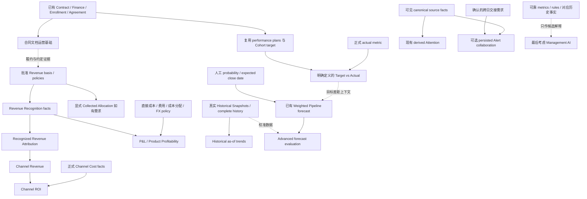

# v3.24 Roadmap Decision — 合同文档运营基础

Verdict: **V324_ROADMAP_DECISION_READY**

日期：2026-10-05。状态：**建议已形成，尚未批准实施；PROPOSED / NOT FROZEN**。
本文是路线决策，不是新领域契约，也不代表任何 v3.24 功能已实现。

## Current Baseline

| 项目 | 实际状态 |
|---|---|
| Branch | `main` |
| Starting / Final HEAD | `b0b1992cb65a2e29dae1d7656bf03ff94cd477d8` |
| v3.23 checkpoint | 已提交：`feat: add management intelligence trends and attention` |
| 正式版本 | `3.23.0`，本任务不变更 |
| Runtime | Node `26.10.0` / npm `12.2.0`，使用仓库已保存的 runtime 配置 |
| Opening worktree | CLEAN；不存在待叠加的 v3.23 candidate |
| 本任务 candidate | 仅新增本文；参考读取和检查证据位于 Git ignored 的 `work/v324-roadmap/` |
| 本任务 Git / 环境动作 | 不 commit、不 push、不 deploy、不访问 Production |

v3.23 closure 文档中的 COMMIT READY / NOT RUN 是当时的历史记录；当前 Git HEAD 已证明
正式 checkpoint 成立，不需要重做提交或重新 apply 旧 patch。

## Inspection Scope 与证据

已读取 [AGENTS.md](../AGENTS.md)、[Implementation Status](IMPLEMENTATION_STATUS.md)、
[v3.23 Closure](V323_RELEASE_CLOSURE.md)，以及以下正式架构和 Release Notes：

| 领域 | 冻结架构 | 历史 Release |
|---|---|---|
| Product / Cohort / Enrollment | [架构](COHORT_ENROLLMENT_ARCHITECTURE.md) | [v3.19](RELEASE_V3.19.0.md) |
| Admissions | [架构](ADMISSIONS_ARCHITECTURE.md) | [v3.20](RELEASE_V3.20.0.md) |
| Channel / Commission | [架构](CHANNEL_COMMERCIAL_ARCHITECTURE.md) | [v3.21](RELEASE_V3.21.0.md) |
| Student Success | [架构](STUDENT_SUCCESS_ARCHITECTURE.md) | [v3.22](RELEASE_V3.22.0.md) |
| Management Intelligence | [架构](MANAGEMENT_INTELLIGENCE_ARCHITECTURE.md) | [v3.23](RELEASE_V3.23.0.md) |

源码检查限于上述候选涉及的 schema 定义、正式读取公式、合同导出、部署版本与 migration
发现机制。未执行全仓 audit、业务修改、数据库 mutation、build 或浏览器 QA。
以下“未发现”等结论指这次有界检查，没有把缺少用户访谈当作已确认需求。

### 必须纠正的三个前提

1. **CRM 已有局部 Planning domain。** `performance_targets` / `performance_allocations`
   已表达 manager、期间、币种、金额、版本、分配及审批；不是从零开始的 Target 缺口。
   [原始模型](../db/migrations/202607160004_approvals_and_performance_allocations.sql)、
   [当前保存契约](../db/migrations/202607170009_reporting_and_delivery.sql)、
   [提交审批约束](../db/migrations/202607170012_integrity_and_versions.sql) 可作为复用依据。
   Product Cohort 也已有 `target_enrollment`：[Cohort schema](../db/migrations/202610030091_product_cohorts.sql)。
   `relationship_target_settings` 是关系运营百分比目标；家庭教育需求的 `budget_min/max`
   是客户预算，不是公司运营 Budget。不能合并这些事实。
2. **已有人工概率加权 Pipeline forecast。**
   [Sales repository](../lib/sales-repository.ts) 和
   [Sales Performance UI](../components/sales-performance-page.tsx) 调用既有报告；
   [多币种报告](../db/migrations/202607200046_multicurrency_export_integrity.sql)
   使用 open Opportunity 的 `amount × probability / 100`，按 `expected_close_date` 和币种归集。
   它不是 Revenue/Cash forecast，也没有冻结 forecast vintage、校准与回测基础。
   v3.23 Management Deferred 不意味着整个 CRM 从未实现 Target / Forecast。
3. **存在狭窄 snapshot 能力。**
   [DQ daily snapshots](../db/migrations/202607200048_business_expansion_v220.sql)
   保存 workspace 级质量计数；
   [exchange rate snapshots](../db/migrations/202607170026_operational_product_foundations.sql)
   服务于既有汇率/业绩导出。它们都不是可复用为所有 Management 指标的历史事实仓库。

## Capability Gap Map

Business leverage 是路线判断，不是已测得的 ROI。Financial risk 指错误口径或错误写入的风险。

| Candidate | Current facts available? | Missing domain facts | Depends on another candidate? | Mutation required? | Financial risk | Complexity | Business leverage |
|---|---|---|---|---|---|---|---|
| Revenue Attribution | Contract、Payment/Refund、Enrollment PRIMARY/ASSIST、业绩收款贡献；无正式 Revenue attribution ledger | 被分配的 Revenue 基准、受益维度、allocation policy、共享合同拆分依据、修正/冲销及证据 | 先有明确 Revenue fact/basis；若采用 recognized basis，依赖 Recognition；现金基准只能另称 Collected Attribution | 是，明确分配事实与版本 | 高：重复/过量分配、混用收款和收入 | 高 | 解锁可追溯 Revenue 分布，当前不能安全回答 Channel Revenue |
| Revenue Recognition | 合同、应收计划、已确认收款、退款、交付上下文 | 履约义务、确认政策、确认期间/日期、履约证据、gross/net 边界、修正与期间控制 | 需业务/财务政策和真实交付依据；不依赖 Sales Target；不自动依赖 Attribution | 是，正式确认事实及更正 | 很高：会改变财务结果口径 | 很高 | 收入及后续 P&L 的基础；政策尚不足以直接编码 |
| Channel Revenue / ROI | Organization、Agreement、Enrollment Attribution、Commission ledger / Settlement | 正式 Revenue attribution；ROI 还缺渠道全部成本及 ROI 分母定义 | Revenue basis → Attribution → Channel Revenue；再加渠道成本才有 ROI | Revenue 读取本身可纯读；依赖事实需要写入 | 很高：Commissionable Base 或合同金额冒充收入 | 高 | 可回答渠道经营收益，现阶段 prerequisite 不成立 |
| Targets / Quota / Budget | 已有 performance plan / allocations / approvals；Cohort 招生目标；无等价完整公司 Budget | 一致的 actual metric 契约、期间拆分/overlap 政策、scope、修订与冲突契约；公司成本 Budget 另缺成本事实 | Target vs Actual 依赖所选择 actual source；不必等待 Revenue，只能准确命名为收款/报名目标等 | 是，优先复用现有 plan | 中高：把 gross/legacy actual 当 net，目标重复计数 | 中 | 可让已有目标正确进入 Management；缺少新 scope 的真实需求确认 |
| Forecasting | 手工 Opportunity probability、expected close date、加权 Pipeline 报告；正式 period trends | 预测对象/期限、vintage、校准、误差评价；Cash/Revenue forecast 分别缺支付/确认时序模型 | Weighted Pipeline 无需 Target；校准型预测需历史信息；Revenue forecast 需 Revenue facts；Targets 仅提供目标差距上下文 | 现有读取无需；冻结预测/人工调整才需事实写入 | 高：把预测当收入或承诺 | 高 | 已能做基础 Pipeline 预估，不宜以新 Forecast 模型作为下一版本主题 |
| P&L / Product Profitability | Finance 收款退款、Product/Cohort、Commission ledger | Revenue、直接成本、其他成本、成本分摊、Commission expense、退款与期间/币种政策 | Revenue + 成本基础 + allocation；不是只依赖 Commission | 是，成本/会计事实与分配 | 很高：现金余额冒充利润 | 很高 | 当前无法回答项目利润；跨度超过一个安全的 v3.24 |
| Persisted Management Alerts | 现有六种 source-derived Attention、CRM Tasks、DQ 队列 | 确认的跨日交接需求、Alert identity/reopen、ack/assignment/snooze 生命周期与权限 | 不必依赖 Revenue；但必须有不能由现有 Attention/Task 完成的具体 workflow | 是，独立的协作记录 | 中：与源状态形成第二权威 | 中高 | 未证明需要管理层单独处理生命周期；当前源域可完成处理 |
| Historical Snapshot Warehouse | 正式状态历史、period activity、DQ daily snapshots；没有通用历史 as-of 数据 | 最小 capture contract、schedule/timezone、capture scope、历史权限、retention、失败/缺口语义 | 历史 snapshot trends 依赖捕获；Forecast 校准可使用，但不是所有预测的必要条件 | 是，新增历史证据写入；不是源业务修改 | 中高：伪 backfill、权限/PII 留存 | 高 | 解锁历史 Pipeline/Outstanding，当前需求尚是架构推断 |
| Owner-wide Management Filtering | 各域有独立 owner / team scope | 逐域 owner 含义、人员变化/权限、filter applicability | 先定义 scope；不需要新 owner 事实源 | 通常否 | 中：过滤语义或 count 泄露 | 中 | 可改善检索，但不能模糊地把 Case Owner 等于销售 Owner |
| Configurable KPI Builder | 已有 typed metric registry 和文档定义 | 允许公式、单位/币种、权限组合、版本、执行成本、审查 | 依赖成熟的正式指标 registry / formula constraints | 配置需要写入 | 高：用户错误合计币种/暴露隐藏金额 | 高 | 尚未有自定义公式需求；固定契约更安全 |
| Contract Operations / Documents Foundation | Contract versions/documents、导出审批/job/storage、两份用户参考；当前 export 是表格 | 类型化模板、字段来源、approved template version、填充/渲染；上传提取候选与人工确认 | 可复用 Contract / Agreement / Household / Enrollment；不需要先发明 Revenue、Target 或 Management AI | 后续需要模板/文档事实与显式确认操作；本任务不实现 | 中：错误主体/条款/金额；可用预览和人工确认控制 | 中 | **用户已明确要求**减少逐份合同填写并识别上传内容，能完成当前具体缺失 workflow |
| Data Import Operations Upgrade（用户补充） | 已有六类资源、CSV 模板、CSV/XLSX 解析、字段 mapping、预检/重复人工处理、分批执行/rollback | 联系人等模板字段覆盖不足；完整字段清单、类型/关系模板、模板版本、便捷稳定关联标识与跨文件导入方案 | 依赖各正式 domain 的可写字段和权限；不依赖 Revenue、合同 OCR 或 AI | 后续导入是正式 mutation，必须复用现有导入与 domain 校验 | 中：错误关联、覆盖已有数据、重复身份 | 中高 | **用户明确需要**批量上传机构、家庭、客户联系人及其完整信息，不再依赖少量通用列 |
| Management AI（最后分析） | 可靠的可见 metrics、period trends、有限 source context | 具体决策任务、evaluation、证据引用、确认机制；成熟历史/Target/Revenue 仅按任务需要 | 依赖所解释的可靠事实与规则；不能替代任何缺失 domain | 可只生成建议；任何正式事实仍需域内人工确认 | 很高：错误财务判断、越权/PII、伪因果 | 高 | 目前没有比合同运营更明确的用户任务；不因营销趋势提高优先级 |

## Finance 五种事实必须分开

| 概念 | 当前正式含义 / 来源 | 能否称为 Revenue |
|---|---|---|
| Contracted | 合同 `contract_value`，按 Contract 一次计数 | 不能；是签约金额，不证明履约或收入确认 |
| Receivable | 正式付款计划应收；Outstanding / Overdue 使用 schedule 与 paid_amount | 不能；应收不是已收，也不是收入确认 |
| Collected | canonical Finance 的 net confirmed receipts：`amount - refunded_amount` | 不自动成为 Revenue；已扣退款，不可再减一次 |
| Recognized Revenue | 按批准政策和履约事实归属到期间的收入 | 当前无等价正式 ledger；不能由 Enrollment/Case COMPLETED 推导 |
| Attributed Revenue | 把一个已明确定义的 Revenue fact 按批准分配规则归属到维度 | 当前不存在；Attribution 改变归属，不代替 Recognition |

[Management read model](../db/migrations/202610050106_management_intelligence_read_model.sql)
复用 `contract_finance_snapshot`。共享 Contract 目前保持 unallocated，不按 Enrollment 数量平分。
`performance_contributions` 是人员业绩收款归属，Enrollment Attribution 是招生贡献，Commissionable
Base 是计佣基数；都不能偷换为 Channel Revenue。

**Channel Revenue 能否在没有正式 Revenue Attribution 时安全存在？NO。**
若未来只选择现金事实，必须明确叫 Collected Allocation / Collected Attribution；不能借这个名字
默认解决 recognized Revenue。Product/Cohort/Opportunity/Organization/Owner/Channel 的分配不是同一
维度，更不能因为 Contract 有 Product FK，就假定 shared Cohort allocation 已完成。

Revenue Foundation 也不宜一次包含 Recognition、Allocation、Attribution：先批准 Revenue basis 与
责任边界，再处理需要的来源分配和确认；采用 recognized basis 时先有 Recognition facts，再做
Attribution。Recognize 解决“何时确认”，Attribute 解决“归属谁”，是不同的契约。

### Revenue 与成本的具体阻塞

代理参考说明学生可能向大学/项目主体支付学费，公司存在协调或服务角色。
因此大学学费、客户合同总额是否属于公司 gross Revenue，必须由业务/财务确认；本文不作会计或法律认定。
Product price 不是 Product cost；有界检查未发现足以支持项目直接成本/间接成本分配的正式模型。
已有 Commission payout 也不等于已批准的 expense recognition policy。

所以 P&L 必须先具备 Revenue、Direct Cost、Refund treatment、Commission expense、Other cost
attribution、Currency 和 Period recognition；**Collected − Commission 不能冒充 Product Profit**。
既有业绩导出的汇率 snapshot 不等于通用财务 FX/合并政策；当前 Management 继续隔离币种。

## Candidate Analysis：不做时用户具体缺少什么

### A. Revenue Foundation — Foundation

目前不能在指定财务期间回答“实际确认了多少收入、由什么履约证据支持、退款如何更正”。
这是高架构价值基础，但不是读取 Payment 就能实现。缺少 principal/agent、预收/分期、履约义务与
期间政策的批准输入。用户当前提供的合同差异恰好说明应先整理交付/合同证据。
本任务不建立 Recognition ledger，也不替财务决定政策。

### B. Commercial Planning — Operational / Foundation；第二选择

用户已经能创建/分配/审批 performance plan，也能看到销售业绩目标。
缺少的是把这些目标与当前 canonical actual、refund、currency、calendar 和 Management permission
契约一致地解释。现有 legacy actual 按 CONFIRMED Payment 的 contribution 求和；不能声称已与
v3.23 net collected 完全等价。现有目标重叠/报告分摊政策也需明确，不能把报告均摊当逐月正式目标。

已有 model 的最小关键项是 Target Type、Scope、Period、Owner、monetary Currency、Target Value、
Version/Revision、Status、Audit；后续应先对照已有字段及审批，补真正缺口。
现有保存 RPC 锁住 Draft、递增 version，但签名没有现代 expected revision / payload-bound retry
receipt；这需要未来有界设计，不是本次升级旧 migration。
Company/Team/Owner/Product/Cohort scope 不能全部默认新增；先确认实际采用哪一种目标与 actual。
Budget 要另行定义支出事实，不因“已有 target_amount”就宣称公司 Budget 已存在。

### C. Historical Intelligence — Analytical Foundation

管理者目前不能回答“30 天前的 Open Pipeline / Outstanding / Attention 到底有多少”。
Period activity 已存在，不能反推每一天的 as-of state。真正的 snapshot 需从启用后开始捕获。
已有状态历史可以支持个别指标重建，但必须逐指标证明完整性，不能把当前记录加 created_at/
updated_at 伪 backfill。

价值高于 persisted Alert，但应先确认经理是否确实需要余额/存量变化。
成本包括每次捕获的存储与频率、workspace 时区、捕获失败与缺口、retention、历史归属变化，以及
用户今天看到的历史数据是否仍符合当前 parent visibility。workspace 级一个总数无法保证部分
owner/team 权限的母集安全；不能把 DQ snapshot 的 leader-only 权限直接推广到所有管理指标。
最小可行范围应只选 1–2 个可验证指标，避免把所有 Student narrative/PII 留在历史仓库。

### D. Operational Management Alerts — Operational；明确 Deferred

目前无法保存“我已看过/暂缓至下周/交给另一经理”的管理关注记录；但用户未提出这个协作需求。
现有 Attention 会随源事实自然退出，源域已有 Task / DQ 操作。仅为了常见 Alert Center 形态新增
acknowledgement 不构成需求。未来若证明确有交接问题，Alert 必须只引用 source，自己的协作状态
不得覆盖 Receivable/Risk/Milestone 状态；reopen、重复事件、purge 与权限也需独立设计。

### E. Management AI — Predictive / Assisted interpretation；最后排序

目前没有 AI Executive Summary / Recommendation，但可靠指标本身已可读。
若以后确有“解释某段已发生变化并列出证据”的任务，可消费当前 actor 可见 metrics、typed
context、历史事实及适用 Target；Revenue 分析只有在 Revenue facts 成立后才允许。
它可能推断相关关系或提出待核实解释，不能认定因果、收入、风险、Health 或结果。
任何更改都须人确认并走 canonical mutation；不能生成正式判断后自动回写。
底层事实和评估任务尚不完整，因此它不是 v3.24 优先项。

### F. 合同文档运营基础 — Operational；新增用户需求候选

当前用户不能选择代理/学生项目模板，让系统自动填入对应客户、项目、金额、币种及日期后下载
完整合同，也不能把上传合同转为可逐项核对的结构化候选信息。
[当前 contract export](../scripts/process-generated-jobs.mjs) 只查询合同/Organization/Product 并输出
一行 tabular data；CSV/XLSX/PDF 格式不等于法律正文模板。该查询还没有完整 Household/Guardian
文档字段来源。已有 [job repository](../lib/generated-jobs-repository.ts)、
[contract document/version schema](../db/migrations/202607170011_sales_intelligence.sql) 和
[合同审批入口](../components/contracts-page.tsx) 可复用，避免另造导出和存储系统。

这里的上传识别属于合同文档 evidence ingestion，不是 Management AI；提取结果仅为候选，不能
自动成为 Contract/Payment/Refund/Commission 事实。此候选来自用户明确需求，优先于未经确认的
管理 Alert 或历史仓库扩展。

## Dependency Graph 与分层

箭头表示事实/能力依赖，虚线表示可提供证据或上下文，并不等于硬 prerequisite。



- **Foundation**：Revenue basis/Recognition；正式成本；逐域 Target/actual contract；最小历史捕获。
- **Operational**：合同文档、现有 plan 的一致化；有真实交接需求时才考虑 Alert。
- **Analytical**：正式 Attribution、Channel Revenue、P&L、历史 as-of 分布。
- **Predictive**：经过评价的 Forecast 与 AI；Trend 不会自动升级成预测。

## 透明 Roadmap 评分

仅用于本路线选择，不是 CRM business fact，不入库。各项 1–5；Value/Readiness/Leverage 越高越好，
Risk/Dependency Burden 越高越难。公式：**Score = Value + Readiness + Leverage − Risk − Burden**。
Business Value 是基于当前明确用户任务及仓库缺口的判断，不是访谈或财务回报测量。

| Candidate | Value | Data readiness | Architectural leverage | Implementation risk | Dependency burden | Score |
|---|---:|---:|---:|---:|---:|---:|
| Contract Operations / Documents Foundation | 5 | 4 | 4 | 3 | 2 | **8** |
| Commercial Planning 一致化 | 4 | 4 | 4 | 3 | 2 | **7** |
| Historical Intelligence | 4 | 3 | 5 | 4 | 3 | **5** |
| Revenue Recognition Foundation | 5 | 2 | 5 | 5 | 4 | **3** |
| Revenue Attribution | 5 | 2 | 5 | 4 | 5 | **3** |
| Persisted Management Alerts | 2 | 3 | 2 | 3 | 2 | **2** |
| 新 Forecast 模型 / evaluation foundation | 3 | 3 | 3 | 4 | 4 | **1** |
| P&L / Product Profitability | 4 | 1 | 4 | 5 | 5 | **−1** |
| Channel Revenue / ROI | 4 | 1 | 3 | 5 | 5 | **−2** |
| Management AI | 2 | 2 | 2 | 5 | 5 | **−4** |

## Recommendation

**Recommended v3.24: Contract Operations / Documents Foundation — 合同文档运营基础。**

只选这个 primary domain；不同时加入 Revenue、Targets、Forecast 或 Management AI。
用户新增的合同需求作为候选 F 纳入同一判断，而不是附带塞进 Revenue/Planning 版本。

**Why now**：合同事实、审批、导出任务及版本基础已经存在，用户也给出了两份具体参考；缺口是
把这些事实转成正确、可追溯的完整合同，以及从电子合同提取待确认字段。这直接减少重复录入，
并先整理 Revenue 讨论所需要的真实主体、费用和交付约定。它不自动定义会计事实。

**Second choice**：Commercial Planning 一致化。若合同文档暂不进入实施，优先复用已存在的
performance plan / allocations 和 Cohort target，正式定义它们与 actual 的关系，而不是建第二套
Targets。需要先由业务选择 monetary collection / enrollment count 等具体目标和最小 scope。

**Why not others**：Revenue Foundation 缺少必须批准的政策；Historical Intelligence 的存量对比
需求仍待确认且有权限/留存成本；P&L/ROI 的 Revenue 与成本前提不足；Alert 缺少交接需求；新
Forecast/AI 不应代替上述基础事实。评分提供参考，实际用户 workflow 和 prerequisite 才决定顺序。

**不会解决**：Revenue Recognition/Attribution、Channel ROI、P&L、目标达成、预测、历史 snapshot、
Alert 协作、Management AI。不会把合同签署/上传当付款确认、Admissions decision 或成功结果。

## 合同参考与后续模板任务

本次只读取原件；没有修改、交付新的 DOCX 模板。下面是未来实施输入和校对清单。

| Reference | 类型 / 适用链 | 必须先校对 |
|---|---|---|
| `<workspace>` | 渠道代理合作；应先匹配 Channel Agreement，而非强行当 Student buyer Contract | 文件年份 2026，正文签署日为 2025-12-17；主体/日期必须参数化。佣金 USD 3,000/学生，原文有登记、Offer、入学满一个月未退出等条件，不等同现有 Commission eligibility |
| `<workspace>` | 学生项目服务；Buyer/Household/Guardian 与 participant Enrollment 区分 | 标题是香港大学项目，证书条款写Example Education Organization，不能直接套用；费用 15,980 RMB，分项 12,980 + 3,000 是参考值，不是默认产品价格/成本；项目行程及收费/退款条款需批准 |

原件 SHA256：

```text
AIS agent reference:
3fd472fbc5dbf73b4fb4f96255d9b9fc92698d20a4b7eb8b9652156f18cc957e

Summer student reference:
b7750ecd0f91075a45a408063e71f2c39c759f4e18afa87a13d3d5e9c20f4712
```

两份合同甲乙方角色不同，不能用同一 party-name 规则替换。后续字段 mapping 至少包括：

| Field group | Canonical source / 后续确认 | 边界 |
|---|---|---|
| Contract reference / amount / currency / dates | 正式 Contract；代理协议字段从正式 Agreement 派生 | 不从模板金额覆盖数据库，不把学费当公司收入 |
| Customer / agent party | Organization 或 Household 的批准信息；company legal entity 资料须确认来源 | Participant ≠ Buyer；Guardian 签署角色需明确，不能自动认定联系人就是法定监护人 |
| Product / Cohort / participant | Contract link / Enrollment → Cohort → Product | 模板只读派生；不创建第二套 Student/Product/Cohort editable facts |
| Fee schedule / itinerary / included services | 批准的合同条款与相应正式项目配置；不足时显式填写并审核 | 分项服务费不是内部成本；不能把参考行程当所有 Cohort 默认安排 |
| Commission / settlement clauses | Agreement / Rule 支持的事实 + 经批准的条款 | 当前 engine 不等于已检查 Offer 和入学满一月；不静默新增资格规则 |
| Signatures / approvals / template revision | 正式审批、文档 version/checksum 与签署证据 | 下载/上传不自动标记 SIGNED/ACTIVE，不自动确认付款 |

### Task 1A — 模板适配与自动填充（未来）

为这两类建立经过业务审阅的模板版本与字段清单；清除日期/大学名称冲突，保留需要批准的服务、
取消、退款、责任条款。模板适配不是本次重新撰写法律意见。自动填充应复用现有审批、job、文件
存储与 Contract version，支持缺字段反馈、预览与对应文档下载；不能继续把单行导出称为完整合同。
原文件不覆盖；交付新模板时要做实际渲染/版式 QA，检查中文、金额大写、分页和签署区。

### Task 1B — 上传识别与显式确认（未来）

先支持文件存储/校验、文字型 DOCX/PDF 提取与类型化候选；扫描件 OCR 若有需求再选择实现。
按字段展示原文位置、候选值、缺失/冲突与置信不足状态，由有权限用户确认。
提取文本/AI inference ≠ business fact；确认保存仍须走现有 workspace、owner、revision、retry
receipt 与 audit 契约。不得自动创建 Payment、Refund、签署状态或 Commission rule。
合同附件按正式 privacy/retention 策略管理，不把护照、银行资料、健康条款内容复制到 Student
Success 或 Audit narrative。详细文档阅读权限不得弱于源 Contract / Agreement。

## Proposed v3.24 Phases — 尚未实施

| Phase | 范围 | 未来可验收结果 |
|---|---|---|
| 1 — Contract Type & Template Contract | 检查现有 Contract/Agreement/document lifecycle；定义两类 party/field mapping、版本与审核；适配两份参考 | 两份新模板可渲染校对；大学/日期冲突处理；缺失和 unsupported policy 显式标出；不复制源域身份 |
| 2 — Deterministic Generation & Download | 复用审批/job/storage，按正式事实填充与预览，处理 Household/Guardian context；保留生成文件和源版本 | 按币种/金额/主体生成可下载正文；缺字段不静默补值；模板和输入版本可追溯；授权不旁路 |
| 3 — Upload Extraction & Human Confirmation | 文本型电子合同字段候选、原文定位、冲突核对、显式保存；按真实需求限定 OCR | 原件不变；候选不自动回写；旧 revision / retry / hidden source 受到保护；不引入 Management AI |
| 4 — Operational Readiness & Release Closure | 两类合同有界端到端验证、文件 privacy/retention、权限/审批/job 回归、架构/Release/metadata、部署兼容检查 | 仅在所有 gate 通过后考虑 3.24.0 promotion；不补 Revenue/Targets/Alert/Forecast 等 Deferred |

这些 phases 是 proposed scope。模板条款、主体来源、下载格式、扫描件支持、允许确认哪些字段
都需要 Phase 1 的事实检查和业务选择；本文未批准 schema、API、migration 或实现路径。

## Proposed Later Sequence — PROPOSED / NOT FROZEN

用户补充提出全面、分类的数据上传需求后，建议把 Data Import Operations Upgrade 提前到
Revenue Foundation 之前。它是独立主题，不扩大 v3.24 合同文档范围；以下排期仍未批准实施。

| Version | 单一候选主题 | 进入前条件 / 解锁能力 |
|---|---|---|
| v3.25 | Data Import Operations Upgrade：分类模板与完整数据导入 | 用户已明确需求；先对照完整业务表单和正式 mutation，确定机构、家庭、联系人及关联关系的可导入字段；复用现有 import workflow，详见 Task 3 |
| v3.26 | Revenue Foundation：优先定义并实现所需的 Recognition facts | 业务/财务批准 Revenue basis、gross/net、履约、退款与期间政策；合同文档提供证据但不替代批准。政策未就绪时需重新决策，不能自动开工 |

Revenue Attribution 移至 Revenue Foundation 成立以后重新排期：先确认最小 beneficiary dimension
和 shared allocation，再考虑 Channel Revenue；没有成本事实仍不做 ROI / P&L。
前述评分是原始候选比较；新增数据导入需求优先级来自明确用户 workflow，本次不伪造一组新评分。

Historical Intelligence 留作独立候选，不附带进 Revenue 版本；需确认最小存量对比需求和 snapshot
权限/retention。Persisted Alerts、KPI Builder、Owner-wide filter 与 Management AI 明确 Deferred。
已存在的 weighted Pipeline report 继续使用自己的名称，不称为 Revenue forecast。

## Task 2 — 一键式部署脚本兼容性检查与维护

**本次结论：未发现因 v3.23 更新而必须修改部署脚本；无需源码更新。**

| 检查 | 仓库事实 / 结果 |
|---|---|
| Version discovery | [release-version](../scripts/lib/release-version.mjs) 从 package.json 读取版本并核对 APP_VERSION / README；[runner](../scripts/deploy-production-runner.mjs) 从目标 source 的 package.json 取得版本并验证 health，不固定为旧版 |
| Migration discovery | [db-migrate](../scripts/db-migrate.mjs) 动态发现 migration chain、核对 hash 并 forward migrate；[worker schema check](../scripts/worker-schema-check.mjs) 动态读取最新 migration；不需要手动追加 106–108 |
| Build / runtime | [Dockerfile](../Dockerfile) 使用声明的 Node/npm，复制当前 source/build 与 db；Management 纯读功能未引入额外 service、端口、worker 或必需 env |
| Controller dry-run | `npm run deploy:production:dry-run`：PASS，`LUMINA_PRODUCTION_DEPLOY_DRY_RUN_OK`；只检查本地文件/配置契约，无网络与目标环境操作 |
| Focused version/deploy tests | 5 项版本/部署一致性单元检查 PASS；采用仓库 `--test-isolation=none` 模式 |
| 真正部署 | NOT RUN；未验证远端 Linux/systemd、Docker image build、Production DB 或 tunnel，本地结果不等于已部署 |

未来每次 closure 都要判断新功能是否改变 artifact format、worker依赖、migration/runtime、storage
或环境配置。合同 generation/OCR 若增加真实依赖，再按需要修改一键式部署，并以 dry-run、target
version/schema health、Web/Worker startup 和 forward-only rollback contract 验收。无必要不更改脚本。
这是持续的 release maintenance 任务，不作为第二个 v3.24 primary domain。

## Task 3 — 全面数据上传、分类模板与导入运营升级（用户补充）

状态：**已纳入后续开发计划，PROPOSED / NOT FROZEN，尚未实施**。
建议独立安排在合同文档基础之后、Revenue Foundation 之前，避免“上传文件”一词掩盖不同业务：
合同上传是文档候选识别；数据导入是结构化批量创建/更新正式 records。

### 当前能力与真实缺口

[Import fields](../lib/import-fields.ts) 已区分 `ORGANIZATIONS`、`HOUSEHOLDS`、`CONTACTS`、
`STUDENTS`、`COHORTS`、`ENROLLMENTS`；[模板生成](../lib/import-template.ts) 和
[模板 API](../app/api/imports/template/route.ts) 已有各资源的 blank/example/guide CSV。
[上传 UI](../components/imports-page.tsx) 与 [sheet normalization](../lib/import-sheet.ts)
已有 CSV/XLSX 处理，不能把 XLSX 输入或模板分类说成从未存在。

然而当前 CONTACTS 只有 `nameZh/nameEn/email/phone/title` 五个字段，不能承担完整联系人资料与
机构/家庭关联的批量录入。机构和家庭模板虽已有更多字段，仍需逐项对照当前业务表单、正式
存储和 mutation，确认哪些重要字段缺失、哪些只是说明不充分、哪些关系需独立导入。
不能只增加下载列，却让 [导入 API](../app/api/imports/route.ts) 或执行端忽略这些数据。

### 分类模板规划

| Template | 应覆盖的资料 / 关联 | 范围与实施约束 |
|---|---|---|
| 机构 / Organization | 机构名称、类型/现有分类、地区地址、联系方式、学校/集团属性、上级机构、已有经营/教育档案字段及可授权 owner 信息 | 只导入正式域已经支持或另行批准的字段；上级机构按稳定标识验证，不按名称猜测 |
| 家庭 / Household | 家庭名称、地址、沟通偏好、已有教育期望/背景字段、成员关联入口；收入等现有敏感字段保持可选并受权限约束 | 家庭本身不是一个联系人；不把家长/学生身份塞进同一家庭自由文本列 |
| 客户联系人 / Contact | 完整可维护联系人档案、已有联系方式/沟通属性、角色及其机构/家庭关联 | 对照完整表单补足五列之外的正式可写字段；联系人角色不能仅靠职位或姓名自动推断 |
| 机构—联系人关系 | 机构与联系人的稳定标识、正式关系角色和现有关系属性 | 复用正式关系模型；先确认两端可见，缺失/歧义不得静默新建或自动 merge |
| 家庭—成员关系 | 家庭与成员稳定标识、现有成员角色/关系字段 | 家庭关系与法定监护/签署授权不自动等价；具体 relation schema 在实施前核实 |
| 学生 / Student | 复用已有 student 模板，补齐正式教育档案的合理字段和 Contact/Household 关联说明 | Student ≠ Contact ≠ Enrollment；不复制姓名事实或自动创建 Enrollment |
| Cohort / Enrollment | 保留已有专用模板与正式 lifecycle requirements，完善说明与关联体验 | 不与机构/联系人通用模板混用；不借批量导入绕过 Enrollment lifecycle/history |

上表是需要检查和覆盖的业务分组，不表示所有候选列都已经存在，也不预先批准增加 schema。
首批重点为用户明确提出的 **机构、家庭、客户联系人**；关系模板随正式模型设计确认。

### 具体功能与验收要求

1. **每类单独下载模板**：提供完整模板、基础必填视图、示例和字段说明。规划可填写的 XLSX
   工作簿及兼容 CSV；XLSX 的说明页/下拉/日期格式不替代服务器校验。标明 template type/version、
   必填、选填、枚举、格式、长度和引用字段，不要求用户理解数据库 UUID 才能正确填表。
2. **字段覆盖矩阵**：逐字段列出 business form → canonical field → template → API → execution →
   export/验收；只允许真实支持的字段，未支持项明确显示。联系人、机构、家庭模板各有自己的
   字段清单，不用所有业务合并的大宽表。
3. **稳定关联与导入顺序**：设计可查找的正式编号/已验证引用；如确需导入外部编号，先定义
   workspace 内唯一性和映射政策。规划机构/家庭 → 联系人 → 关系/学生的分阶段预检，允许跨文件
   检查缺失或重复引用；不按同名猜测，不强迫每条资料都必须有机构或家庭。
4. **提交前预检与预览**：显示将创建/更新/跳过的记录及关系，检查必填、日期、枚举、币种、
   active owner、tenant scope 与缺失关联。错误定位到原文件行/列；导出错误清单后可修正重传。
5. **重复与更新政策**：复用现有 duplicate review / repair / mapping profiles；明确空值保留与
   清空、覆盖与追加的语义；CREATE/UPDATE/MERGE/SKIP 需要有权限且可追溯的决定。重复上传不得
   重复建 records/relationships，不能默认 merge 或覆盖现有资料。
6. **可靠执行**：复用现有分批执行、进度、失败行修复、retry 和 rollback；保持后续修改保护。
   真正导入前验证 domain revision、权限与审计，不把浏览器校验当安全边界。当前行数/大小限制
   先沿用，只有实际容量测试证明需要时才调整，不承诺无限导入。
7. **Privacy / Quality**：隐藏的机构、家庭、联系人和关联不可因查询候选/错误信息而泄露；保留
   个人数据清理规则，Audit 不复制整行敏感文本。模板多字段不等于强制收集更多敏感资料。
8. **中英与移动端**：模板标签、说明、预检错误、导入进度及重试反馈覆盖 zh-CN/en；UI 能清楚
   选择类型，选错模板可提示并阻止错误执行，而不是把不认识的列静默丢掉。

### 后续实施切分

| Step | 有界交付 |
|---|---|
| 1 — Import Capability / Field Contract | 确认每域可写字段、关系、稳定引用、模板版本和更新政策；明确现有基础复用点 |
| 2 — Categorized Templates & Preflight | 完整机构/家庭/联系人模板、示例/说明、mapping、预检预览、错误清单 |
| 3 — Relationship / Batch Reliability | 依赖顺序、关联预检、分批写入、重复/冲突、修复重试与回滚保护 |
| 4 — Operational Readiness | 实际导入与普通手工录入一致性、权限/privacy/跨域关系回归、文档与部署兼容检查 |

这些步骤不与本次路线文档变更一起实现。验收时必须用每类实际模板从上传到正式记录/关系验证，
不能只测“文件上传成功”或“模板下载成功”。

## Verification

| Check | Status | 说明 |
|---|---|---|
| v3.23 formal checkpoint / opening clean baseline | PASS | 已存在正式 committed HEAD，未另做 Git 动作 |
| Required architecture / release reads + bounded inspection | PASS | 上述文档与候选对应源码，未 whole-repo audit |
| 两份参考可读 / 原件未修改 | PASS | OOXML 读取和 SHA256；仅 ignored evidence，无新 DOCX 交付 |
| Declared runtime | PASS | Node 26.10.0 / npm 12.2.0 |
| Release metadata remains 3.23.0 | PASS | `npm run release:check`；package/lock/APP_VERSION/README/status 对齐 |
| Local deployment dry-run | PASS | 没有部署或 Production access |
| Focused deployment/version tests | PASS | 5 tests；首次默认进程隔离启动遇到 `spawn EPERM`，改为仓库 no-isolation 后通过；不是源功能失败 |
| Documentation links / whitespace / change boundaries | PASS | 本文链接指向现有文件；tracked source、migration、metadata 与 HEAD 相同；新文档 whitespace 检查通过 |
| Production build / Chromium / PostgreSQL mutation suite | NOT RUN | 本任务未改变业务代码，按用户要求无需执行 |
| New template authoring / feature implementation | NOT RUN | 已纳入未来计划，本次仅研究 |

## Explicit Non-Implementation

No migration；No schema change；No API/UI/source implementation；No version change；
No commit unless separately authorized；本任务没有新增 commit；No push；No deploy；No Production access。
仅新增本路线文档，不修改现有架构契约或把 Recommendation 写成已批准实施状态。

继续冻结：Management owns no business facts；Opportunity/Contract Amount ≠ Revenue；Receivable ≠
Collected；Commissionable Base / Enrollment Attribution ≠ Channel Revenue；Goal Attainment ≠ Student
Success Rate；Case COMPLETED ≠ Successful Outcome；Trend ≠ Forecast；Comparison ≠ Target；Attention ≠
persisted Alert；Data Quality ≠ Business Risk；AI/extracted candidate ≠ Business Fact。

本次未实现 Revenue Attribution/Recognition、Channel Revenue/ROI、P&L/Gross Margin/Product Profit、
新的 Targets/Quota/Budget、Forecast、persisted Alert/ack/assign/snooze、历史仓库、Management AI、
Success/Risk/Business Score 或 Configurable KPI Builder。
