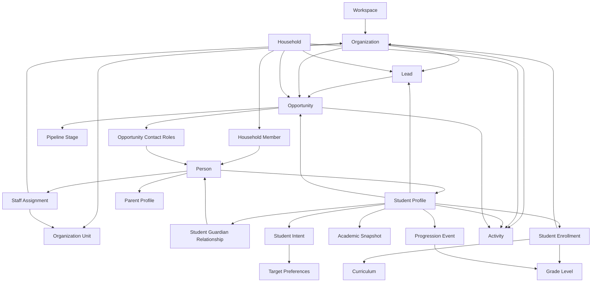

# PostgreSQL / Prisma 数据模型设计说明 V1.0

## 1. 设计目标

本数据模型围绕五个不可替代的业务事实设计：

1. **人不等于职位。** 人员、任职、学校和部门必须分离。
2. **家庭不是学生的附属备注。** 家庭、家庭成员和学生—监护关系必须独立建模。
3. **学生数据具有时间性。** 学籍、课程、年级、成绩、目标和申请阶段必须保留历史。
4. **销售主体不唯一。** Lead和Opportunity可能以学校、家庭或学生为核心，并关联多个联系人。
5. **AI不是事实源。** AI运行、证据、模型、Prompt版本和人工审核必须可追踪。

所有业务表均包含`workspaceId`，为多租户隔离、权限查询和后续数据迁移提供基础。

---

## 2. 技术基线

- 数据库：PostgreSQL
- ORM：Prisma ORM 7风格配置
- 主键：UUID
- 时间：`timestamptz`，业务日期使用`date`
- 金额：`numeric/decimal`，禁止浮点
- 半结构化扩展：`jsonb`
- 模糊搜索：`pg_trgm`
- 文本规范化：`unaccent` + 应用层中文/英文标准化
- 工作流：Temporal，数据库保存业务状态与幂等键
- 文件：对象存储，数据库只保存元数据和Storage Key

Prisma 7使用`prisma.config.ts`配置连接URL，`schema.prisma`只保留provider；生成器使用`prisma-client`并显式设置output。

---

## 3. 聚合边界

## 3.1 身份与权限聚合

核心表：

- `workspaces`
- `users`
- `workspace_memberships`
- `teams`
- `team_memberships`
- `access_roles`
- `permissions`

原则：

- User是平台级身份；
- Workspace Membership是用户在某个租户中的身份；
- 业务Owner引用Membership而非直接引用User，避免跨Workspace错误引用；
- System Role提供默认角色，Access Role提供自定义权限扩展；
- 字段级权限和数据范围由应用权限层执行并写入审计。

## 3.2 学校组织聚合

核心表：

- `organizations`
- `organization_units`
- `organization_curricula`
- `standard_positions`
- `staff_assignments`

`organizations`采用父子关系表达教育集团、学校、校区和其他机构；`organization_units`表达学校内部部门树。

任职关系不写入Person，而通过`staff_assignments`保存：

- 当前与历史职位；
- 标准职位和原始Title；
- 部门；
- 决策角色；
- 影响力；
- 关系强度；
- 态度；
- 信息来源与最近确认时间。

## 3.3 人员聚合

核心表：

- `people`
- `person_contact_methods`
- `school_staff_profiles`
- `parent_profiles`
- `person_relationships`

Person只保存基础身份。Profile只保存某类身份特有字段。

联系方式独立建模的原因：

- 一人可以有多个邮箱、手机号和社交账号；
- 每种类型可以选择主联系方式；
- 可记录验证、失效、退订和同意状态；
- 共享家庭电话不应被数据库唯一约束错误拒绝；
- 通过标准化值和相似度索引产生重复候选。

## 3.4 家庭聚合

核心表：

- `households`
- `household_members`
- `student_guardian_relationships`

`household_members`表达人员属于哪个家庭；`student_guardian_relationships`表达某位成人对某个学生的具体责任。

同一个家庭成员对不同学生可能具有不同角色，例如：

- 对学生A是主要联系人和付款人；
- 对学生B只是普通家庭成员；
- 某祖父母可能是实际决策人但不是法定监护人。

因此不能只在Household Member上保存单一“家长角色”。

## 3.5 学生学术聚合

核心表：

- `student_profiles`
- `academic_calendars`
- `curricula`
- `grade_levels`
- `grade_progression_rules`
- `student_enrollments`
- `student_academic_snapshots`
- `student_subject_records`
- `assessment_types`
- `student_assessment_attempts`
- `student_intents`
- `student_target_preferences`
- `student_experiences`

设计规则：

- `student_profiles`引用Person，不复制姓名和联系方式；
- `student_enrollments`保存当前与历史学校、课程和年级；
- `student_academic_snapshots`按学年/学期保存快照，避免覆盖历史；
- 科目成绩进入独立记录；
- 标化考试通过Assessment Type配置；
- 升学目标使用Intent版本和Target Preference列表，不把多国、多校、多专业塞入单个文本字段。

## 3.6 自动升年级聚合

核心表：

- `academic_calendars`
- `grade_progression_rules`
- `student_progression_exceptions`
- `student_progression_events`

关键字段：

- `idempotencyKey`：防止同一学生同一学年重复升级；
- `beforeSnapshot` / `afterSnapshot`：支持审计和回滚；
- `workflowId` / `workflowRunId`：关联Temporal；
- `status`：保存完整状态机；
- `approvedByMembershipId`：记录人工批准；
- `transitionType`：标准升级、留级、跳级、转学、毕业或人工处理。

Temporal负责调度、重试和补偿，PostgreSQL负责最终业务事实与唯一性约束。

## 3.7 销售聚合

核心表：

- `pipelines`
- `pipeline_stages`
- `leads`
- `lead_status_history`
- `opportunities`
- `opportunity_stage_history`
- `opportunity_contact_roles`
- `products`
- `opportunity_products`
- `contracts`
- `payments`

Lead和Opportunity采用多个可空外键关联业务主体，并通过数据库CHECK约束确保至少存在一个主体。

Opportunity Stage变化写入历史表，当前Stage只用于高效查询；历史表用于：

- 阶段转化；
- 停留时间；
- 销售预测回溯；
- 阶段变化审计。

## 3.8 活动和任务聚合

核心表：

- `activities`
- `activity_participants`
- `tasks`
- `task_collaborators`
- `documents`

Activity可同时关联学校、人员、家庭、学生、Lead和Opportunity，以形成跨对象统一时间线。

对外有效沟通必须：

- 产生下一步任务；或
- 明确填写`nextActionWaivedReason`。

该规则建议由服务层事务执行，数据库只提供基础字段和约束。

## 3.9 导入与数据治理聚合

核心表：

- `import_jobs`
- `import_source_files`
- `import_mappings`
- `import_row_issues`
- `import_entity_results`
- `import_rollbacks`
- `entity_merges`
- `data_quality_issues`

导入结果按行保存动作和前后快照，使系统可以：

- 输出逐行报告；
- 追踪创建、更新、合并、跳过和错误；
- 对导入批次执行反向操作；
- 审计谁在何时导入了哪些数据。

## 3.10 报告与AI聚合

核心表：

- `report_templates`
- `report_jobs`
- `ai_providers`
- `ai_models`
- `ai_prompt_templates`
- `ai_runs`
- `ai_evidence`

报告分为：

1. 数据库计算的`metricSnapshot`；
2. AI或人工生成的`narrativeDraft`；
3. 最终生成文件。

二者分离可防止模型篡改结构化数字。

---

## 4. 核心关系图

---

## 5. 时间与历史策略

### 5.1 采用独立历史表的对象

- Lead状态；
- Opportunity Stage；
- 学生升年级；
- 学术快照；
- 任职；
- 学籍；
- 学生Intent版本。

### 5.2 采用Audit Log的对象

所有核心对象的创建、修改、删除、恢复、合并、导入、导出和敏感读取。

### 5.3 软删除

以下对象默认软删除：

- Organization；
- Organization Unit；
- Person；
- Staff Assignment；
- Household；
- Student Profile；
- Enrollment；
- Lead；
- Opportunity；
- Activity；
- Task；
- Document；
- Contract。

应用查询必须默认附加`deletedAt IS NULL`。

---

## 6. 多租户隔离

### 6.1 基础规则

- 所有业务表包含`workspaceId`；
- API不得接收客户端传入的可信workspaceId，必须从Session解析；
- Repository方法必须显式要求Workspace Context；
- 创建关联记录时验证所有外键属于同一Workspace；
- 批量操作和导入同样执行租户校验；
- 审计日志保存workspaceId。

### 6.2 PostgreSQL RLS

可在系统稳定后增加Row Level Security作为第二道防线，但不建议在MVP中仅依赖RLS。原因：

- Prisma连接池和后台Worker需要可靠设置会话变量；
- Temporal Worker、报告Job和迁移脚本拥有不同权限上下文；
- 错误配置可能造成隐性空结果或越权。

推荐顺序：

1. 应用Repository强制租户过滤；
2. 集成测试覆盖跨租户访问；
3. 再评估RLS与数据库角色分离。

---

## 7. 搜索与重复检测

### 7.1 精确标准化

应用层维护：

- `normalizedName`；
- `normalizedEmail`；
- `normalizedValue`；
- `websiteDomain`；
- 电话E.164格式；
- 中英文标点、空格和大小写归一化。

### 7.2 模糊搜索

使用`pg_trgm`索引：

- 学校displayName、englishName、normalizedName；
- 人员displayName、chineseName、englishName、normalizedName；
- 联系方式normalizedValue。

### 7.3 重复候选，不强行唯一

以下内容只生成重复候选：

- 手机；
- 家庭共用邮箱；
- 同名同校；
- 学生姓名、学校与年级；
- 学校名称与城市。

以下内容可唯一：

- Workspace slug；
- 用户normalizedEmail；
- 工作区内字典code；
- 学生升年级idempotencyKey；
- 合同编号；
- 对象存储key。

---

## 8. Prisma与原生SQL的职责分工

### Prisma Schema负责

- 模型、枚举、字段类型；
- 主键、外键；
- 常规唯一索引和普通索引；
- referential actions；
- 类型安全Client生成。

### 原生迁移SQL负责

- `pg_trgm`和`unaccent`扩展；
- 跨字段CHECK约束；
- 部分唯一索引；
- 表达式索引；
- 复杂搜索索引；
- 必要的数据库函数；
- 后续可选的RLS策略。

每次执行Prisma Migrate时建议：

1. `prisma migrate dev --create-only`；
2. 审查自动SQL；
3. 合并补充SQL；
4. 在临时数据库验证；
5. 执行迁移测试；
6. 再进入Staging。

---

## 9. 事务边界

以下操作必须在单个数据库事务或可补偿工作流中完成：

- Lead转化；
- Opportunity Stage变更与历史记录；
- Person合并；
- Organization合并；
- 学生升年级；
- 导入单行写入；
- 导入批次回滚；
- 合同成交与Opportunity Won；
- Activity创建与下一步Task创建；
- Owner批量变更与审计。

---

## 10. 幂等策略

### 学生升年级

`workspaceId + idempotencyKey`唯一，建议Key组成：

`studentProfileId:enrollmentId:academicYearTo:ruleVersion`

### 导入

使用：

- 文件checksum；
- importJobId；
- rowNumber；
- 目标实体指纹。

### AI运行

可以使用：

- purpose；
- entityType；
- entityId；
- source version；
- prompt version；
- model version。

避免在相同数据未变化时重复产生高成本运行。

---

## 11. 数据保留建议

- 审计日志：至少7年，具体按运营地区法规调整；
- 学生与家庭记录：按业务合同、同意和法律要求制定保留策略；
- 导入源文件：默认180天，可配置；
- 导出文件：默认7天自动失效；
- AI输入快照：对敏感内容设置短期保留或脱敏；
- 软删除记录：进入保留期后才允许受控硬删除；
- 合同与付款：遵循财务和税务保留要求。

---

## 12. Schema使用说明

工程包包含：

- `prisma/schema.prisma`：主Schema；
- `prisma.config.ts`：Prisma 7配置；
- `.env.example`：连接字符串样例；
- `prisma/migrations/0001_domain_constraints.sql`：PostgreSQL补充扩展、约束和索引。

Schema是开发起点，不应未经业务确认直接用于Production。正式实施前需要完成：

1. 字段命名评审；
2. 权限矩阵评审；
3. 学年与年级字典确认；
4. Pipeline与阶段确认；
5. 个人信息和未成年人数据合规评审；
6. 用真实匿名样本执行导入演练；
7. 使用Prisma CLI在项目依赖安装完成后执行`format`和`validate`；
8. 生成首个create-only migration并审查SQL。
